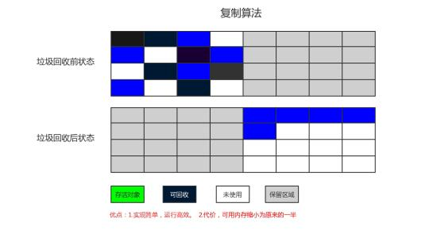
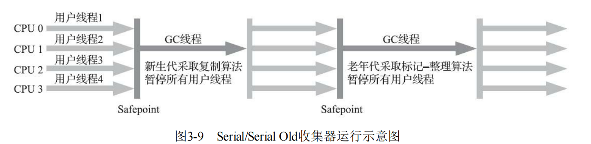
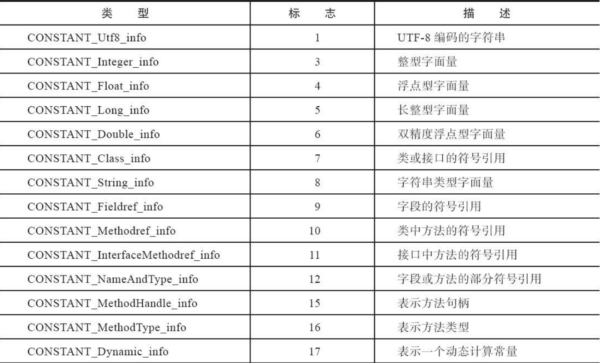

​		`Java ME（Micro Edition）`：支持`Java`程序运行在移动终端（手机、PDA）上的平台，对`Java API`有所精简，并加入了移动终端的针对性支持，这条产品

线在`JDK 6`以前被称为`J2ME`，但使用`Java`语言开发程序的`Android`并不属于`Java ME`。

​		`Java SE（Standard Edition）`：支持面向桌面级应用（如`Windows`下的应用程序）的`Java`平台，提供了完整的`Java`核心`API`，这条产品线在`JDK 6`以前被

称为`J2SE`。

​		`Java EE（Enterprise Edition）`：支持使用多层架构的企业应用（如`ERP、MIS、CRM`应用）的`Java`平台，除了提供`Java SE API`之外，还对其做了大量有针

对性的扩充，并提供了相关的部署支持，这条产品线在`JDK 6`以前被称为`J2EE`，在`JDK 10`以后被`Oracle`放弃，捐献给`Eclipse`基金会管理，此后被称为

`Jakarta EE`。

内存区域与内存溢出异常

​		`Java`虚拟机在执行`Java`程序的过程中会把它所管理的内存划分为若干个不同的数据区域。


## 运行时数据区域

### 程序计数器

​		程序计数器是一块较小的内存空间，可以看作是当前线程所执行的字节码的行号指示器，在`Java`虚拟机的概念模型里，字节码解释器工作时就是通过改变这

个计数器的值来选取下一条需要执行的字节码指令，它是程序控制流的指示器，分支、循环、跳转、异常处理、线程恢复等基础功能都需要依赖这个计数器来完

成。

​		在`Java`虚拟机的多线程是通过线程轮流切换、分配处理器执行时间的方式来实现的，所以为了线程切换后能恢复到正确的执行位置，每条线程都需要一个独

立的程序计数器，它们之间互不影响，独立存储，称这类内存区域为`"`线程私有`"`的内存。

​		线程如果执行的是一个`Java`方法，计数器记录的是正在执行的虚拟机字节码指令的地址；如果是一个本地（`Native`）方法，其值为空（`Undefined`）。此内

存区域是唯一一个没有规定任何`OutOfMemoryError`情况的区域。


### Java虚拟机栈

​		`Java`虚拟机栈也是线程私有的，生命周期与线程相同。其描述的是`Java`方法执行的线程内存模型：每个方法被执行的时候，`Java`虚拟机都会同步创建一个

**栈帧**，用于存放局部变量表、操作数栈、动态连接、方法出口等信息。方法被调用直至之心完毕的过程，对应一个栈帧在虚拟机栈中从入栈到出栈的过程。

​		通常意义是将`Java`内存区域分为**堆和栈**，此时的栈即为虚拟机栈，更多情况下指的是虚拟机栈中的局部变量表。

​		局部变量表存放了编译期可知的各种`Java`虚拟机基本数据类型`(boolean、byte、char、short、int、float、long、double)`、对象引用`(reference`类型，它并

不等同于对象本身，可能是一个指向对象起始地址的引用指针，也可能是指向一个代表对象的句柄或者其他与此对象相关的位置`）`和`returnAddress`类型`（`指向

了一条字节码指令的地址`）`。这些数据类型在局部变量表的存储空间以**局部变量槽**来表示，`long、doudle`占用两个，其余的只占用一个。

​		局部变量表所需要的内存空间在编译器完成分配，进入一个方法时，此方法需要多大的局部变量空间是完全确定的（编译期确定了有多少局部变量，并且各种

局部变量所需要的变量槽都是确定的），方法运行期间局部变量表的大小（变量槽的数量）不变。

​		虚拟机栈规定了两类异常状况：如果线程请求的栈深度大于虚拟机所允许的深度，将抛出`StackOverflowError`异常；如果虚拟机容量可以动态扩展，当栈扩

时无法申请到足够的内存会抛出`OutOfMemoryError`异常。`HotSpot`虚拟机的栈容量是不可以动态扩展的，因此，`HotSpot`虚拟机不会因为虚拟机栈而导致`OOM`异

常。所以，只要线程申请栈空间成功了就不会有`OOM`，申请时就失败了，仍然会出现`OOM`异常。


### 本地方法栈

​		本地方法栈是为虚拟机使用到的本地方法服务。`HotSpot`虚拟机直接将本地方法栈和虚拟机栈合二为一。所以本地方法栈也会在栈深度溢出或者栈扩展失败时

分别抛出`StackOverflowError`和`OurOfMemoryError`异常。


### Java堆

​		`Java`堆是虚拟机所管理的内存中最大的一块，其是垃圾收集器管理的内存区域（GC堆）。被所有线程共享的一块内存区域。在**虚拟机启动时创建**。唯一的

目的就是存放对象实例。几乎所有的对象实例都在这里分配内存`(`字符串常量池也存放在此处`)`。（随着`Java`语言的发展，现在已经能看到些许迹象表明日后可

能出现值类型的支持，即使只考虑现在，由于即时编译技术的进步，尤其是逃逸分析技术的日渐强大，栈上分配、标量替换优化手段已经导致一些微妙的变化悄然

发生，所以说`Java`对象实例都分配在堆上也渐渐变得不是那么绝对了）。

​		从分配内存的角度看，所有线程共享的`Java`堆中可以划分出多个线程私有的分配缓冲区，以提升对象分配时的效率。无论怎么划分，其存储的只能是对象的

实例。

​		`Java`堆可以处于物理上不连续的内存空间中，但在逻辑上它应该被视为连续的。但对于大对象`（`典型的如数组对象`）`，多数虚拟机实现出于实现简单、存

储高效的考虑，很可能会要求连续的内存空间。`Java`堆既可以被实现成固定大小的，也可以是可扩展的，不过当前主流的`Java`虚拟机都是按照可扩展来实现的

`（`通过参数`-Xmx`和`-Xms`设定`)`。如果在`Java`堆中没有内存完成实例分配，并且堆也无法再扩展时，`Java`虚拟机将会抛出`OutOfMemoryError`异常。


### 方法区

​		方法区也是各个线程共享的内存区域，它用于存储已被虚拟机加载的类型信息、常量、静态变量、即时编译器编译后的代码缓存等数据。

​		此区域的内存回收目标主要是针对常量池的回收和对类型的卸载。

​		如果方法区无法满足新的内存分配需求时，将抛出OutOfMemory Error异常。


### 运行时常量池

​		此区域是方法区的一部分，`Class`文件中除了有类的版本、字段、方法、接口等描述信息外，还有一项信息是常量池表，用于存放编译期生成的各种字面量

与符号引用，这部分内容将在类加载后存放到方法区的运行时常量池中。一般来说，除了保存`Class`文件中描述的符号引用外，还会把由符号引用翻译出来的直接

引用也存储在运行时常量池中。

​		运行时常量池相对于`Class`文件常量池的另外一个重要特征是具备动态性，`Java`语言并不要求常量一定只有编译期才能产生，也就是说，并非预置入

`Class`文件中常量池的内容才能进人万法区运行时吊量池，运行期间也可以将新的常量放入池中，这种特性被开发人员利用得比较多的便是`String`类的

`intern()`方法。


​		既然运行时常量池是方法区的一部分，自然受到方法区内存的限制，当常量池无法再申请到内存时会抛出`OutOfMemoryError`异常。


### 直接内存

​		直接内存并不是虚拟机运行时数据区的一部分。但是这部分内存也被频繁地使用，而且也可能导致`OutOfMemoryError`异常出现。

​		在`JDK 1.4`中新加入了`NIO (New Input/Output）`类，引入了一种基于通道与缓冲区的`I/O`方式，它可以使用`Native`函数库直接分配堆外内存，然后通过一

个存储在`Java`堆里面的`DirectByteBuffer`对象作为这块内存的引用进行操作。这样能在一些场景中显著提高性能，因为避免了在`Java`堆和`Native`堆中来回复制

数据。

​		显然，本机直接内存的分配不会受到`Java`堆大小的限制，但是，既然是内存，则肯定还是会受到本机总内存大小以及处理器寻址空间的限制，一般服务器管

理员配置虚拟机参数时，会根据实际内存去设置`-Xmx`等参数信息，但经常忽略掉直接内存，使得各个内存区域总和大于物理内存限制，从而导致动态扩展时出现

`OutOfMemoryError`异常。


## HotSpot虚拟机中的对象

​		此时的对象限于普通`Java`对象，不包括数组和Class对象等。

### 创建

​		当`Java`虚拟机遇到一条字节码`new`指令时，首先将去检查这个指令的参数是否能在常量池中定位到一个类的符号引用，并且检查这个符号引用代表的类是否

已被加载、解析和初始化过。如果没有，那必须先执行相应的类加载过程。

​		在类加载检查通过后，接下来虚拟机将为新生对象分配内存。对象所需内存的大小在类加载完成后便可完全确定，为对象分配空间的任务实际上便等同于把一

块确定大小的内存块从`Java`堆中划分出来。假设`Java`堆中内存是**绝对规整**的，所有被使用过的内存都被放在一边，空闲的内存被放在另一边，中间放着一个指针

作为分界点的指示器，那所分配内存就仅仅是把那个指针向空闲空间方向挪动一段与对象大小相等的距离，这种分配方式称为`"`指针碰撞`"`。但如果`Java`堆中的

内存并不是规整的，已被使用的内存和空闲的内存相互交错在一起，那就没有办法简单地进行指针碰撞了，虚拟机就必须维护一个列表，记录上哪些内存块是可用

的，在分配的时候从列表中找到一块足够大的空间划分给对象实例，并更新列表上的记录，这种分配方式称为`"`空闲列表`"`。选择哪种分配方式由`Java`堆是否

规整决定，而`Java`堆是否规整又由所采用垃圾收集器是否带有空间压缩整理的能力决定。因此，当使用带压缩整理过程的收集器时，系统采用的分配算法是指

针碰撞，既简单又高效；而当使用这种基于清除算法的收集器时，理论上就只能采用较为复杂的空闲列表来分配内存`(`为了能在多数情况下分配得更快，设计了一

个叫作`LinearAllocation Buffer`的分配缓冲区，通过空闲列表拿到一大块分配缓冲区之后，在它里面仍然可以使用指针碰撞方式来分配`)`。


​		对象创建在虚拟机中是非常频繁的行为，即使仅仅修改一个指针所指向的位置，在并发情况下也并不是线程安全的，可能出现正在给对象`A`分配内存，指针

还没来得及修改，对象`B`又同时使用了原来的指针来分配内存的情况。

​		两种可选方案：

​				一：对分配内存空间的动作进行同步处理——实际上虚拟机是采用`CAS`配上失败重试的方式保证更新操作的原子性。

​				二：把内存分配的动作按照线程划分在不同的空间之中进行，即每个线程在`Java`堆中预先分配一小块内存，称为本地线程分配缓冲`(TLAB）`，哪个线程

​		要分配内存，就在哪个线程的本地缓冲区中分配了，分配新的缓存区时才需要同步锁定。虚拟机是否使用`TILAB`，可以通过`-XX:+UseTLAB`参效来设定。

​		

​		内存分配完成之后，虚拟机必须将分配到的内存空间`(`但不包括对象头`)`都初始化为零值，如果使用了`TLAB`的话，这一项工作也可以提前至`TLAB`分配时顺

便进行。这步操作保证了对象的实例字段在`Java`代码中可以不赋初始值就直接使用（即默认值的来源），使程序能访问到这些字段的数据类型所对应的零值。

​		接下来，`Java`虚拟机还要对对象进行必要的设置，例如这个对象是哪个类的实例、如何才能找到类的元数据信息、对象的哈希码`(`实际上对象的哈希码会延

后到真正调用`Object:hashCode()`方法时才计算`)`、对象的`GC`分代年龄等信息。这些信息存放在对象的对象头`(Object Header)`之中。根据虚拟机当前运行状态

的不同，如是否启用偏向锁等，对象头会有不同的设置方式。


​		在上面工作都完成之后，从**虚拟机的视角**来看，一个新的对象已经产生了。但是从`Java`程序的视角看来，对象创建才刚刚开始——构造函数，即`Class`文件

中的`<init>()`方法还没有执行，所有的字段都为默认的零值，对象需要的其他资源和状态信息也还没有按照预定的意图构造好。一般来说`(`由字节码流中`new`指

令后面是否跟随`invokespecial`指令所决定，`Java`编译器会在遇到`new`关键字的地方同时生成这两条字节码指令，但如果直接通过其他方式产生的则不一定如

此`)`，`new`指令之后会接着执行`<init>()`方法，按照程序员的意愿对对象进行初始化，这样一个真正可用的对象才算完全被构造出来。


### 内存布局

​		对象在堆内存的存储布局中划分为三部分：对象头，实例数据，对齐填充。

#### 对象头

​		两类信息：

​				一：用于存储对象自身的运行时数据，如哈希码`(HashCode)`、`GC`分代年龄、锁状态标志、线程持有的锁、偏向线程`ID`、偏向时间戳等，这部分数据的

​		长度在32位和64位的虚拟机（未开启压缩指针）中分别为32个比特和64个比特，官方称它为`Mark Word`。其被设计成一个有着动态定义的数据结构，以便在

​		极小的空间内存储尽量多的数据，根据对象的状态复用自己的存储空间。

​				二：类型指针，即对象指向它的类型元数据的指针，`Java`虚拟机通过这个指针来确定该对象是哪个类的实例。并不是所有的虚拟机实现都必须在对象数

​		据上保留类型指针。此外，如果对象是一个`Java`数组，那在对象头中还必须有一块用于记录数组长度的数据，因为虚拟机可以通过普通`Java`对象的元数据

​		信息确定`Java`对象的大小，但是如果数组的长度是不确定的，将无法通过元数据中的信息推断出数组的大小。


#### 实例数据

​		是对象真正存储的有效信息，即我们在程序代码里面所定义的各种类型的字段内容，无论是从父类继承下来的，还是在子类中定义的字段都必须记录起来。这

部分的存储顺序会受到虚拟机分配策略参数(-XX: FieldsA llocationSty le参数）和字段在Java源码中定义顺序的影响。HotSpot虚拟机默认的分配顺序为

`longs/doubles、ints、shorts/chars、by tes/booleans、oops (OrdinaryObject Pointers)`，从以上默认的分配策略中可以看到，相同宽度的字段总是被分配到一

起存放，在满足这个前提条件的情况下，在父类中定义的变量会出现在子类之前。如果`HotSpot`虚拟机的`+XX: CompactFields`参数值`为true`(默认就为`true`)，那

子类之中较窄的变量也允许插入父类变量的空隙之中，以节省出一点点空间。


#### 对齐填充

​		这部分并不是必然存在的，也没有特别的含义，它仅仅起着占位符的作用。由于`HotSpot`虚拟机的自动内存管理系统要求对象起始地址必须是**8字节**的整数

倍，换句话说就是**任何对象的大小都必须是8字节的整数倍**。对象头部分已经被精心设计成正好是8字节的倍数`(`1倍或者2倍`）`，因此，如果对象实例数据部分没

有对齐的话，就需要通过对齐填充来补全。


### 访问定位

​		创建对象后，`Java`程序会通过栈上的`reference`数据来操作堆上的具体对象。由于`reference`类型在只规定了它是一个指向对象的引用，并没有定义这个引

用应该通过什么方式去定位、访问到堆中对象的具体位置，所以对象访问方式也是由虚拟机实现而定的，主流的访问方式有两种：

​				一：句柄。`Java`堆中将可能会划分出一块内存来作为句柄池，`reference`中存储的就是对象的句柄地址，而句柄中包含了对象实例数据与类型数据各自

​		具体的地址信息。此方法最大的好处就是`reference`中存储的是稳定句柄地址，在对象被移动`(`垃圾收集时移动对象是非常普遍的行为`)`时只会改变句柄中

​		的实例数据指针，而`reference`本身不需要被修改。


​				二：直接指针。`Java`堆中对象的内存布局就必须考虑如何放置访问类型数据的相关信息，`reference`中存储的直接就是对象地址，如果只是访问对象本

​		身的话，就不需要多一次间接访问的开销。此方法最大的好处就是速度更快，它节省了一次指针定位的时间开销，HotSpot虚拟机主要使用此种方式进行对象

​		访问`(`有例外情况，如果使用了`Shenandoah`收集器的话也会有一次额外的转发`)`。


# 垃圾收集器与内存分配策略

​		垃圾收集器所关注的内存部分为：**`Java`堆**和**方法区**。

​		`Java`的内存管理子系统，通过可达性分析算法来判断对象是否存活。基本思路：通过一些列称为`"GC Roots"`的根对象作为起始节点集，从这些节点开始，根

据引用关系向下搜索，搜索过程走过的路径称为`"`引用链`"(Reference Chain)`，如果某个对象到GCRoots间没有任何引用链相连，或者用图论的话来说就是从`GC `

`Roots`到这个对象不可达时，则证明此对象是不可能再被使用的。


​		固定可作为`GC Roots`的对象：

​				在虚拟机栈`(`栈帧中的本地变量表`)`中引用的对象，譬如各个线程被调用的方法堆栈中使用到的参数、局部变量、临时变量等。

​				在方法区中类静态属性引用的对象，譬如`Java`类的引用类型静态变量。

​				在方法区中常量引用的对象，譬如字符串常量池`(String Table)`里的引用。

​				在本地方法栈中`JNI(`即通常所说的`Native`方法`)`引用的对象。

​				`Java`虚拟机内部的引用，如基本数据类型对应的`Class`对象，一些常驻的异常对象`(`比如`NullPointExcepiton、OutOfM emoryError)`等，还有系统类加

​		载器。

​				所有被同步锁`(synchronized`关键字`)`持有的对象。

​				反映`Java`虚拟机内部情况的`JMXBean、JVMTI`中注册的回调、本地代码缓存等。

​		除了这些固定的`GC Roots`集合以外，根据用户所选用的垃圾收集器以及当前回收的内存区域不同，还可以有其他对象`"`临时性`"`地加入，共同构成完整`GC `

`Roots`集合。


​		引用：`JDK1.2`之前对引用的定义为：如果`reference`类型的数据中存储的数值代表的是另外一块内存的起始地址，就称该`reference`数据是代表某块内存、

某个对象的引用。`JDK1.2`之后，对此定义进行了扩充，将引用分为强引用，软引用，弱引用，虚引用。4种引用强度一次逐渐减弱。

​		强引用：最传统的`"`引用`"`的定义，是指在程序代码之中普遍存在的引用赋值，即类似`"Objectobj=new Object()"`这种引用关系。无论任何情况下，只要强

引用关系还存在，垃圾收集器就永远不会回收掉被引用的对象。

​		软引用：用来描述一些还有用，但非必须的对象。只被软引用关联看的对家，仕系统将妥及‘A内存溢出异常前，会把这些对象列进回收范围之中进行第二次回

收，如果这次回收还没有足够的内存，才会抛出内存溢出异常。在`JDK 1.2`版之后提供了`SoftReference`类来实现软引用。

​		弱引用：用来描述那些非必须对象，但是它的强度比软引用更弱一些，被弱引用关联的对象只能生存到下一次垃圾收集发生为止。当垃圾收集器开始工作，尤

论当前内仔是省足够，都会凹牧挥只被弱引用关联的对象。在`JDK 1.2`版之后提供了`WeakReference`类来实现弱引用。

​		虚引用：也称为`"`幽灵引用`"`或者`"`幻影引用`"`，它是最弱的一种引用关系。一个对家定省有成引用内存在，完全不会对其生存时间构成影响，也无法通过

虚引用来取得一个对象实例。为一个对象设置虚引用关联的唯一目的只是为了能在这个对象被收集器回收时收到一个系统通知。在`JDK 1.2`版之后提供了

`PhantomReference`类来实现虚引用。


## 对象的回收

​		在可达性分析算法中判定为不可达的对象，它们暂时还处于`"`缓刑`"`阶段，要真正宣告一个对象死亡，至少要经历两次标记过程:如果对象在进行可达性分析

后发现没有与`GC Roots`相连接的引用链，那它将会被第一次标记，随后进行一次筛选，筛选的条件是此对象是否有必要执行`finalize()`方法。假如对象没有覆盖

`finalize()`方法，或者`finalize()`方法已经被虚拟机调用过，那么虚拟机将这两种情况都视为`"`没有必要执行`"`。

​		如果被判定为确有必要执行`finalize()`方法，那么该对象将会被放置在一个名为`F-Queue`的队列之中，并在稍后由一条由虚拟机自动建立的、低调度优先级

的`Finalizer`线程去执行它们的`finalize()`方法。一个类的`finalize()`方法只会被执行一次。

​		执行：是指虚拟机会触发这个方法开始运行，但并不承诺一定会等待它运行结束。这样做的原因是，如果某个对象的`finalize()`方法执行缓慢，或者更极端

地发生了死循环，将很可能导致`F-Queue`队列中的其他对象永久处于等待，甚至导致整个内存回收子系统的崩溃。`finalize()`方法是对象逃脱死亡命运的最后一

次机会，稍后收集器将对`F-Queue`中的对象进行第二次小规模的标记，如果对象要在`finalize()`中成功拯救自己，只要重新与引用链上的任何一个对象建立关联

即可，譬如把自己`(this关键字)`赋值给某个类变量或者对象的成员变量，那在第二次标记时它将被移出`"`即将回收`"`的集合;如果对象这时候还没有逃脱，那基本

上它就真的要被回收了。

```java
public class JvmCase {
    public static JvmCase SAVE_HOOK = null;

    public void isAlive() {
        System.out.println("yes, i am still alive :)");
    }

    // 这个方法只会被执行一次，并不推荐用下面的方式来拯救对象
    @Override
    protected void finalize() throws Throwable {
        super.finalize();
        System.out.println("finalize method executed!");
        JvmCase.SAVE_HOOK = this;
    }

    public static void main(String[] args) throws Throwable {
        SAVE_HOOK = new JvmCase();
        SAVE_HOOK = null;
        System.gc();

        Thread.sleep(500);

        if(SAVE_HOOK != null)
        {
            SAVE_HOOK.isAlive();
        }
        else
        {
            System.out.println("no, i am dead(");
        }

        SAVE_HOOK = null;
        System.gc();

        Thread.sleep(500);

        if(SAVE_HOOK != null)
        {
            SAVE_HOOK.isAlive();
        }
        else
        {
            System.out.println("no, i am dead(");
        }


    }
}
/*
finalize method executed!
yes, i am still alive :)
no, i am dead(
*/
```


## 方法区的回收

​		方法区的垃圾收集主要回收两部分内容：废弃的常量和不再使用的类型。回收废弃常量与回收`Java`堆中的对象非常类似。

​		例如字符串的回收：假如一个字符串`"java"`曾经进入常量池中，但是当前系统又没有任何一个字符串对象的值是`"java"`，换句话说，已经没有任何字符串对

象引用常量池中的`"java"`常量，且虚拟机中也没有其他地方引用这个字面量。如果在这时发生内存回收，而且垃圾收集器判断确有必要的话，这个`"java"`常量就

将会被系统清理出常量池。常量池中其他类`(`接口`)`、方法、字段的符号引用也与此类似。

​	

​		不再使用的类需要满足三个条件：

​				1、该类所有的实例都已经被回收，也就是`Java`堆中不存在该类及其任何派生子类的实例。

​				2、加载该类的类加载器已经被回收，这个条件除非是经过精心设计的可替换类加载器的场景，否则通常是很难达成的。

​				3、该类对应的`java.lang Class`对象没有在任何地方被引用，无法在任何地方通过反射访问该类的方法。

​		`Java`虚拟机被允许对满足上述三个条件的无用类进行回收，`"`被允许`"`：而并不是和对象一样，没有引用了就必然会回收。关于是否要对类型进行回收，

`HotSpot`虚拟机提供了`-Xnoclassgc`参数进行控制。


## 垃圾收集算法

​		`HotSpot`虚拟机使用的是被称为`"`追踪式垃圾收集`"`算法，也被称为简介垃圾收集。

​		分代收集理论：

​				弱分代假说：绝大多数对象都是朝生夕灭的。

​				强分代假说：熬过越多次垃圾收集过程的对象就月难以消亡。

​		基于以上理论，奠定了多款常用的垃圾收集器的一致的设计原则：收集器应该将`Java`堆划分出不同的区域，然后将回收对象依据其年龄`(`年龄即对象熬过垃

圾收集过程的次数`)`分配到不同的区域之中存储。

​		现在的虚拟机至少会把`Java`堆划分为**新生代和老年代**两个区域。顾名思义，在新生代中，每次垃圾收集时都发现有大批对象死去，而每次回收后存活的少量

对象，将会逐步晋升到老年代中存放。其中存在的困难：对象不是孤立的，对象之间会存在跨代引用。

​		解决方案：在遍历完固定的`GC Roots`之外，在额外遍历另一区域的所有对象来确保可达性分析结果的正确性。虽然此方法可行，但无疑会带来很大的性能负

担。

​		第三条假说：

​				跨代引用假说：跨代引用相对于同代引用来说仅占极少数。

​		依据这条假说，就不应再为了少量的跨代用去扫描另一区域的整体，也不必浪费空间专门记录每一个对象是否存在及存在哪些跨代引用，只需在当前区域上

建立一个全局的数据结构`(`该结构被称为`"`记忆集`")`，这个结构把另一区域划分成若干小块，标识出另一区域的哪一块内存会存在跨代引用。此后当发生垃圾手

机时，只有包含了跨代引用的小块内存里的对象才会被加入到`GC Roots`进行扫描。虽然这种方法需要在对象改变引用关系`(`如将自己或者某个属性赋值`)`时维护

记录数据的正确性，会增加一些运行时的开销，但比起收集时扫描另一区域的整体来说仍然是划算的。`(`通常能单独发生收集行为的知识新生代`)`


### 标记-清除算法

​		此算法分为**标记和清除**两个阶段：首先标记出所有需要回收的对象，在标记完成后，统一回收所有被标记的对象，也可以反过来，标记存活的对象，统一回收

所有未被标记的对象。标记过程就是对象是否属于垃圾的判定过程。

​		缺点：

​				一：执行效率不稳定，如果`Java`堆中包含大量对象，而且其中大部分是需要被回收的，这时必须进行大量标记和清除的动作，导致标记和清除两个过程

​		的执行效率都随对象数量增长而降低。

​				二：内存空间的碎片化问题，标记、清除之后会产生大量不连续的内存碎片，空间碎片太多可能会导致当以后在程序运行过程中需要分配较大对象时无

​		法找到足够的连续内存而不得不提前触发另一次垃圾收集动作。


### 标记-复制算法

​		为了解决标记`-`清除算法面对大量可回收对象时执行效率低的问题，此垃圾收集算法将可用内存按容量划分为大小相等的两块，每次只使用其中的一块。当

这一块的内存用完了，就将还存活着的对象复制到另外一块上面，然后再把已使用过的内存空间一次清理掉。如果内存中多数对象都是存活的，这种算法将会产生

大量的内存间复制的开销，但对于多数对象都是可回收的情况，算法需要复制的就是占少数的存活对象，而且每次都是针对整个半区进行内存回收，分配内存时也

就不用考虑有空间碎片的复杂情况，只要移动堆顶指针，按顺序分配即可。这样实现简单，运行高效，不过其缺陷也显而易见，这种复制回收算法的代价是将可用

内存缩小为了原来的一半，空间浪费未免太多了一点。



​		`HotSpot`虚拟机的`Serial、ParNew`等新生代收集器均采用了更优化的策略来设计新生代的内存布局。具体做法是把新生代分为一块较大的`Eden`空间和两块较

小的`Survivor`空间，每次分配内存只使用`Eden`和其中一块`Survivor`。发生垃圾搜集时，将`Eden`和`Survivor`中仍然存活的对象一次性复制到另外一块

`Survivor`空间上，然后直接清理掉`Eden`和已用过的那块`Survivor`空间。`HotSpot`虚拟机默认`Eden`和`Survivor`的大小比例是`8∶1`，也即每次新生代中可用内存

空间为整个新生代容量的`90%`，只有一个`Survivor`空间，即`10%`的新生代是会被`"`浪费`"`的。当然，`98%`的对象可被回收仅仅是普通场景下测得的数据，任何人

都没有办法百分百保证每次回收都只有不多于`10%`的对象存活，因此还有一个充当罕见情况的逃生门的安全设计，当`Survivor`空间不足以容纳一次垃圾手机之后

存活的对象时，就需要依赖其他内存区域`(`实际上大多就是老年代`)`进行分配担保。


### 标记-整理算法

​		以上两种算法都是针对新生代的，针对老年代对象的存亡特征，提出了另外一种有针对性的`"`标记-整理`"`算法，其中的标记过程仍然与`"`标记-清除`"`算法

一样，但后续步骤不是直接对可回收对象进行清理，而是让所有存活的对象都向内存空间一端移动，然后直接清理掉边界以外的内存，


## HotSpot的算法实现细节

### 根节点枚举

​		固定作为`GC Roots`的根节点主要在全局性的引用`(`常量或类静态属性等`)`，与执行上下文`(`栈帧中的本地变量表等`)`。根节点枚举是必须要暂停用户线程

的，当用户线程停顿下来之后，其实并不需要一个不漏的检查完所有执行上下文和全局的引用位置，虚拟机应当是有办法直接得到哪些地方存放这对象引用的。

​		在`HotSpot`中，是使用一组称为`OopMap`的数据结构来达到这个目的。一旦类加载动作完成的时候，`HotSpot`就会把对象内什么偏移量上是什么类型的数据计

算出来，在即时编译过程中，也会在特定的位置记录下栈里和寄存器里哪些位置是引用。这样收集器在扫描时就可以直接得知这些信息了，并不需要真正一个不漏

地从方法区等`GC Roots`开始查找。


### 安全点

​		记录引用的位置被称为安全点，所以用户程序执行时并非在代码指令流的任意位置都能够停顿下来开始垃圾收集，而是强制要求必须执行到达安全点后才能够

暂停。而安全点的选取是以：是否具有让程序长时间执行的特征为标准。长时间执行的最明显的特征就是指令序列的复用，如方法调用，循环跳转，异常跳转等。

​		另外需要考虑的问题是：如何在垃圾收集发生时让所有线程（不包括执行`JNI`调用的线程）都跑到安全点，然后停顿下来。

​				1、抢先式中断：不需要线程的执行代码主动去配合，在垃圾收集发生时，系统首先把所有用户线程全部中断，如果发现有用户线程中断的地方不在安全

​		点上，就恢复这条线程执行，让它一会再重新中断，知道跑到安全点上。但几乎没有虚拟机实现采用这种方式暂停线程响应`GC`事件。

​				2、主动式中断：当垃圾收集需要中断线程的时候，不直接对线程操作，仅仅简单地设置一个标志位，各个线程执行过程时会不同地主动去轮询这个标

​		志，一旦发现中断标志为真时就自己在最近的安全点上主动中断挂起。轮询标志的地方和安全点是重合的，另外还要加上所有创建对象和其他需要在`Java`堆

​		上分配内存的地方，这是为了检查是否即将要发生垃圾收集，避免没有足够内存分配新对象。


### 安全区域

​		安全点机制保证了程序执行时，在不太长的时间内就会遇到可进入垃圾收集过程的安全点。但是当用户线程没有分配处理器时间，典型的场景便是用户线程处

于`Sleep`状态或者`Blocked`状态，这时候线程无法响应虚拟机的中断请求，不能再走到安全的地方去中断挂起自己，虚拟机也显然不可能持续等待线程重新被激活

分配处理器时间。对于这种情况，就必须引入安全区域来解决。

​		安全区域是指能够确保在某一段代码片段之中，引用关系不会发生变化，因此，在这个区域中任意地方开始垃圾收集都是安全的。我们也可以把安全区域看作

被扩展拉伸了的安全点。

​		当用户线程执行到安全区域里面的代码时，首先会标识自己已经进入了安全区域，那样当这段时间里虚拟机要发起垃圾收集时就不必去管这些已声明自己在安

全区域内的线程了。当线程要离开安全区域时，它要检查虚拟机是否已经完成了根节点枚举（或者垃圾收集过程中其他需要暂停用户线程的阶段)，如果完成了，

那线程就当作没事发生过，继续执行;否则它就必须一直等待，直到收到可以离开安全区域的信号为止。


### 记忆集和卡集

​		记忆集用来解决对象跨代引用所带来的问题，不仅仅是新生代、老年代之间才有跨代引用的问题，所有设计部分区域手机行为的垃圾收集器都会面临相同的问

题。

​		记忆集是一种用于记录从非收集区域执行收集区域的指针集合的抽象数据结构。最简单的实现可以用非收集区域中所有含跨代应用的对象数组来实现这个数据

结构。但此种方式无论是空间占用还是维护成本都相当昂贵。

​		而在垃圾收集的场景中，收集器只需要通过记忆集判断出某一块非收集区域是否存在有指向了收集区域的指针就可以了，并不需要了解这些跨代指针的全部细

节。那在实现记忆集的时候，便可以选择更为粗犷的记录粒度来节省记忆集的存储和维护成本。

​				1、字长精度：每个记录精确到一个机器字长`(`就是处理器的寻址位数，如常见的32位或64位，这个精度决定了机器访问物理内存地址的指针长度`）`，

​		该字包含跨代指针。
​				2、对象精度：每个记录精确到一个对象，该对象里有字段含有跨代指针。

​				3、卡精度：每个记录精确到一块内存区域，该区域内有对象含有跨代指针。

​		卡精度：指的是用一种称为卡表的方式去实现记忆集，这也是目前最常用的一种记忆集实现形式，它定义了记忆集的记录精度、与堆内存的映射关系等。

​		卡表最简单的形式可以只是一个字节数组，而`HotSpot`也是这么做的：

```c++
CARD_TABLE [this address >> 9 ] = 0;
/*
	字节数组 CARD_TABLE 的每个元素都对应这其标识的内存区域中一块特定大小的内存块，这个内存块被称作卡页。
	一个卡页的内存中通常包含不止一个对象，只要卡页内有一个或更多对象的字段存在着跨代指针，那就将对应卡表的数组元素的值标识为 1 ，称为元素变脏，没有则标识为 0 ，在垃圾收集发生时，只要筛选出卡表中变脏的元素，把它们加入 GC Roots 中一并扫描即可。
*/
```


### 写屏障

​		`HotSpot`虚拟机通过使用写屏障技术来维护卡表状态。写屏障可以看作在虚拟机层面对**引用类型字段赋值**这个动作的`AOP`切面，在引用对象赋值时会产生一

个环形通知，供程序执行额外的动作，也就是说赋值的前后都在写屏障的覆盖范畴内。在赋值前的部分的写屏障叫作写前屏障，在赋值后的则叫作写后屏障。

​		应用写屏障后，虚拟机就会为所有赋值操作生成相应的指令，一旦收集器在写屏障中增加了更新卡表操作，每次只要对引用进行更新，就会产生额外的开销，

不过这个开销与新生代收集时扫描整个老年代的代价相比还是低得多的。

​		除了写屏障的开销外，卡表在高并发场景下还面临着伪共享问题。伪共享是处理并发底层细节时一种经常需要考虑的问题，现代中央处理器的缓存系统中是以

缓存行为单位存储的，当多线程修改互相独立的变量时，如果这些变量恰好共享同一个缓存行，就会彼此影响（写回、无效化或者同步）而导致性能降低。

​		为了避免伪共享问题，一种简单的解决方案是不采用无条件的写屏障，而是先检查卡表标记，只有当该卡表元素未被标记过时才将其标记为变脏。

```c++
if(CARD_TABLE[ this address >> 9 ] != 0)
{
    CARD_TABLE[ this address >> 9 ] = 0;
}
```


### 并发的可达性分析

​		为什么必须在一个能保障一致性额快照上才能进行对象的图的遍历：

​		引入三色标记作为工具来辅助推导，把遍历对象图过程中遇到的对象，按照是否访问过这个条件标记成以下三种颜色：

​				1、白色：表示对象尚未被垃圾收集器访问过。显然在可达性分析刚刚开始的阶段，所有的对象都是白色的，若在分析结束的阶段，仍然是白色的对象，

​		即代表不可达。
​				2、黑色：表示对象已经被垃圾收集器访问过，且这个对象的所有引用都已经扫描过。黑色的对象代表已经扫描过，它是安全存活的，如果有其他对象引

​		用指向了黑色对象，无须重新扫描一遍。黑色对象不可能直接（不经过灰色对象）指向某个白色对象。

​				3、灰色：表示对象已经被垃圾收集器访问过，但这个对象上至少存在一个引用还没有被扫描过。

​		当用户线程与收集器是并发工作时，收集器在对家图上标记颜巴，同时用户线程在修改应用关系`—`即修改对象图的结构，这样可能出现两种后果：

​				一：把原本消亡的对象错误标记为存活，这不是好事，但其实是可以容忍的，只不过产生了一点逃过本次收集的浮动垃圾而已，下次收集清理掉就好。

​				二：把原本存活的对象错误标记为已消亡，这就是非常致命的后果了，程序肯定会因此发生错误。


​		当且仅当以下两个条件同时满足时，会产生对象消失的问题，即原本应该是黑色的对象被误标为白色：

​				1、赋值器插入了一条或多条从黑色对象到白色对象的新引用。

​				2、赋值器删除了全部从灰色对象到该白色对象的直接或间接引用。

​		解决方案：

​				1、增量更新：破坏第一个条件，当黑色对象插入新的指向白色对象的引用关系时，就将这个新插入的引用记录下来，等并发扫描结束之后，再将这些记

​		录过的引用关系中的黑色对象为根，重新扫描一次。这可以简化理解为，黑色对象一旦新插入了指向白色对象的引用之后，它就变回灰色对象了。

​				2、原始快照：破坏第二个条件，当灰色对象要删除指向白色对象的引用关系时，就将这个要删除的引用记录下来，在并发扫描结束之后，再将这些记录

​		过的引用关系中的灰色对象为根，重新扫描一次。这也可以简化理解为，无论引用关系删除与否，都会按照刚刚开始扫描那一刻的对象图快照来进行搜索。


## 经典垃圾收集器


​		如果两个收集器之间存在连线，说明它们可以搭配使用。

### Serial收集器

​		`Serial`收集器是最基础，历史最悠久的收集器。这个收集器是一个单线程工作的收集器，单线程的意义并不仅仅是说明它只会使用一个处理器或一条收集线

程去完成垃圾收集工作，更重要的是强调在它进行垃圾收集时，必须暂停其他所有工作线程，直到它收集结束。这项工作是由虚拟机在后台自动发起和自动完成

的。


​		此收集器目前仍然是`HotSpot`虚拟机运行在客户端模式下的默认新生代虚拟机，因为其简单而高效。对于存资源受限的环境，它是所有收集器里额外内存消耗

最小的；对于单核处理器或处理器核心数较少的环境来说，Serial收集器由于没有线程交互的开销，专心做垃圾收集自然可以获得最高的单线程收集效率。


### ParNew收集器

​		`ParNew`收集器实质上是`Serial`收集器的多线程并行版本，除了同时使用多条线程进行垃圾收集之外，其余的行为包括`Serial`收集器可用的所有控制参数

、收集算法、暂停用户进程、对象分配规则、回收策略等都与`Serial`收集器完全一致，在实现上这两种收集器也共用了相当多的代码。


​		`ParNew`收集器除了支持多线程并行收集之外，其他与`Serial`收集器相比并没有太多创新之处，但它却是不少运行在服务端模式下的`HotSpot`虚拟机，首选的

新生代收集器，其中有一个与功能、性能无关但其实很重要的原因是：除了`Serial`收集器外，目前只有它能与`CMS`收集器配合工作。


### Parallel Scavenge收集器

​		`Parallel Scavenge`收集器也是一款新生代收集器，它同样是基于**标记`-`复制**算法实现的收集器，也是能够并行收集的多线程收集器。

​		`Parallel Scavenge`收集器的特点是它的关注点与其他收集器不同，`CMS`等收集器的关注点是尽可能地缩短垃圾收集时用户线程的停顿时间，而`Parallel` 

`Scavenge`收集器的目标则是达到一个可控制的吞吐量。所谓吞吐量就是处理器用于运行用户代码的时间与处理器总消耗时间的比值，即：


​		停顿时间越短就越适合需要与用户交互或需要保证服务响应质量的程序，良好的响应速度能提升用户体验;而高吞吐量则可以最高效率地利用处理器资源，尽

快完成程序的运算任务，主要适合在后台运算而不需要太多交互的分析任务。

```shell
-XX: MaxGCPauseMillis   最大垃圾收集停顿时间
-XX: GCTimeRatio     设置吞吐量大小，1~99的整数，垃圾收集时间占总时间的比率
-XX: +UseAdaptiveSizePolicy  设置此参数后，虚拟机会根据当前系统的运行情况收集性能监控信息，动态调整一系列参数以提供最合适的停顿时间或者最大的吞吐量。
```


### Serial Old收集器

​		`Serial Old`是`Serial`收集器的老年代版本，它同样是一个单线程收集器，使用**标记`-`整理**算法。




### Parallel Old收集器

​		`Parallel Old`是`Parallel Seavenge`收集器的老年代版本，支持多线程并发收集，基于**标记`-`整理**算法实现。

​		在注重吞吐量或者处理器资源较为稀缺的场合，都可以优先考虑`Parallel Scavenge`加`Paralel Old`收集器这个组合。


### CMS收集器

​		CMS收集器是一种以获取最短回收停顿时间为目标的收集器。其基于**标记`-`清除**算法实现。运行过程分为四个部分：

​				1、初始标记

​				2、并发标记

​				3、重新标记

​				4、并发清除

​		初始标记、重新标记这两个步骤仍然需要暂停用户线程。

​		初始标记仅仅只是标记一下`GC Roots`能直接关联到的对象，速度很快。

​		并发标记阶段就是从`GC Roots`的直接关联对象开始遍历整个对象图的过程，这个过程耗时较长但是不需要停顿用户线程，可以与垃圾收集线程一起开发运行。

​		重新标记阶段则是为了修正并发标记期间，因用户程序继续运行而导致标记产生变动的那一部分对象的标记记录，这个阶段的停顿时间通常会比初始标记阶段

稍长一些，但也远比并发标记阶段的时间短。

​		最后是并发清除阶段，清理删除掉标记阶段判断的已经死亡的对象，由于不需要移动存活对象，所以这个阶段也是可以与用户线程同时并发的。


​		从整体看来耗时最长的并发标记和并发清除阶段，垃圾收集器线程都可以与用户线程一起工作。所以从总体上，`CMS`收集器的内存回收过程是与用户现场一

起并发执行的。


​		缺点：

​				1、`CMS`收集器对处理器资源非常敏感。在并发阶段，它虽然不会导致用户线程停顿，但却会因为占用了一部分线程（或者说处理器的计算能力）而导致

​		应用程序变慢，降低总吞吐量。`CMS`启动的回收线程数是（处理器核心数量 + 3）/4，也就是说，如果处理器核心数在四个或以上，并发回收时垃圾收集

​		线程只占用不超过`25%`的处理器运算资源，并且会随着处理器核心数量的增加而下降。但是当处理器核心数量不足四个时，`CMS`对用户程序的影响就可能变

​		得很大。为了缓解这种情况，虚拟机提供了一种称为“增量式并发收集器”的`CMS`收集器变种，其在并发标记、清理的时候让收集器线程、用户线程交替运行，

​		尽量减少垃圾收集线程的独占资源的时间，这样整个垃圾收集的过程会更长，但对用户程序的影响就会显得较少一些，直观感受是速度变慢的时间更多了，但

​		速度下降幅度就没有那么明显。但在JDK7之后已经不提倡使用，在JDK9之后就被完全废弃了。

​				2、然后，由于`CMS`收集器无法处理浮动垃圾，有可能出现并发失败进而导致另一次完全暂停用户进程的回收整个堆得垃圾收集的产生。在`CMS`的并发标

​		记和并发清理阶段，用户线程是还在继续运行的，程序在运行自然就还会伴随有新的垃圾对象不断产生，但这一部分垃圾对象是出现在标记过程结束以后，

​		`CMS`无法在当次收集中处理掉它们，只好留待下一次垃圾收集时再清理掉。这一部分垃圾就称为浮动垃圾。并且还需要预留足够的内存空间来提供给用户线

​		程使用，因此`CMS`收集器必须预留一部分空间供并发运行时程序运行使用，所以其不会等待老年代几乎完全被填满了在进行收集。当预留的空间不足以满足

​		程序的需要，虚拟机会冻结用户线程的执行，临时启用`Serial Old`收集器来重新进行老年代的垃圾收集。

​				3、`CMS`是一款基于**标记`-`清除**算法实现的收集器，意味着收集结束时会有大量空间碎片产生。空间碎片过多时，将会给大对象分配带来很大麻烦，往往

​		会出现老年代还有很多剩余空间，但就是无法找到足够大的连续空间来分配当前对象，而不得不提前触发一次堆空间的垃圾收集的情况。`CMS`收集器提供了

​		一个`-XX:+UseCMS-CompactAtFullCollection`开关参数（默认是开启的，此参数从JDK 9开始废弃），用于在`CMS`收集器不得不进行堆的垃圾收集时开启内存

​		碎片的合并整理过程，由于这个内存整理必须移动存活对象，在`CMS`收集器的实现中是无法并发的。这样空间碎片问题是解决了，但停顿时间又会变长，因

​		此虚拟机还提供了另外一个参数`-XX: CMSFullGCsBefore-Compaction`（此参数从JDK 9开始废弃），这个参数的作用是要求`CMS`收集器在执行过若干次（数量

​		由参数值决定）不整理空间的堆空间的垃圾收集之后，下一次进入堆空间的垃圾收集前会先进行碎片整理（默认值为0，表示每次进入堆空间的垃圾收集时都

​		进行碎片整理)。


### Garbage First收集器

​		`Garbage First(`简称`G1)`收集器是垃圾收集器技术发展历史上的里程碑式的成果，它开创了收集器面向局部收集的设计思路和基于`Region`的内存布局形式。

​		`G1`是一款主要面向服务端应用的垃圾收集器。它可以面向堆内存任何部分来组成回收集进行回收，衡量标准不再是它属于哪个分代，而是哪块内存中存放的

垃圾数量最多，回收收益最大，这就是`G1`收集器的`Mixed GC`模式。

​		`G1`开创的基于`Region`的堆内存布局是它能够实现这个目标的关键。其不再坚持固定大小以及固定数量的分代区域划分，而是把连续的`Java`堆划分为多个大

小相等的独立区域`(Region)`，每一个`Region`都可以根据需要，扮演新生代的`Eden`空间、`Survivor`空间，或者老年代空间。收集器能够对扮演不同角色的

`Region`采用不同的策略去处理，这样无论是新创建的对象还是已经存活了一段时间、熬过多次收集的旧对象都能获取很好的收集效果。

​		`Region`中还有一类特殊的`Humongous`区域，专门用来存储大对象。`G1`认为只要大小超过了一个`Region`容量一半的对象即可判定为大对象。每个`Region`的

大小可以通过参数`-XX:G1HeapRegionSize`设定，取值范围为`1MB~32MB`，且应为2的N次幂。而对于那些超过了整个`Region`容量的超级大对象，将会被存放在N个连

续的`Humongous Region`之中，`G1`的大多数行为都把`Humongous Region`作为老年代的一部分来进行看待。

​		`G1`将`Region`作为单次回收的最小单元，即每次收集到的内存空间都是`Region`大小的整数倍，这样可以有计划地避免在整个`Java`堆中进行全区域的垃圾收

集。处理思路是让`G1`收集器去跟踪各个`Region`里面的垃圾堆积的价值（回收所获得的空间大小以及回收所需时间的经验值）大小，然后在后台维护一个优先级列

表，每次根据用户设定允许的收集停顿时间（使用参数`-XX:MaxGCPauseMillis`指定，默认值是200毫秒)，优先处理回收价值收益最大的那些`Region`。这种使用

`Region`划分内存空间，以及具有优先级的区域回收方式，保证了`G1`收集器在有限的时间内获取尽可能高的收集效率。


​		`Region`里面存在的跨`Region`引用对象：`G1s`收集器使用记忆集避免全堆作为`GC Roots`扫描，但在`G1`收集器上记忆集的应用其实要复杂很多，它的每个

`Region`都维护有自己的记忆集，这些记忆集会记录下别的`Region`指向自己的指针，并标记这些指针分别在哪些卡页的范围之内。`G1`的记忆集在存储结构的本质

上是一种哈希表，`Key`是别的`Region`的起始地址，`Value`是一个集合，里面存储的元素是卡表的索引号。这种双向的卡表结构（卡表是我指向谁，这种结构还记

录了谁指向我）比原来的卡表实现起来更复杂，同时由于`Region`数量比传统收集器的分代数量明显要多得多，因此`G1`收集器要比其他的传统垃圾收集器有着更高

的内存占用负担。

​		并发标记阶段保证收集线程与用户线程互不干扰地运行：`G1`收集器则是通过原始快照`(SATB)`算法来实现的。此外，垃圾收集对用户线程的影响还体现在回

收过程中新创建对象的内存分配上，程序要继续运行就肯定会持续有新对象被创建，`G1`为每一个`Region`设计了两个名为`TAMS`的指针，把`Region`中的一部分空间

划分出来用于并发回收过程中的新对象分配，并发回收时新分配的对象地址都必须要在这两个指针位置以上。`G1`收集器默认在这个地址以上的对象是被隐式标记

过的，即默认它们是存活的，不纳入回收范围。如果内存回收的速度赶不上内存分配的速度，`G1`收集器也要被迫冻结用户线程执行，导致堆垃圾收集而产生长时

间暂停用户线程。

​		建立可靠的停顿预测模型：在垃圾收集过程中，`G1`收集器会记录每个`Region`的回收耗时、每个`Region`记忆集里的脏卡数量等各个可测量的步骤花费的成

本，并分析得出平均值、标准偏差、置信度等统计信息。这里强调的衰减平均值是指它会比普通的平均值更容易受到新数据的影响，平均值代表整体平均状态，但

衰减平均值更准确地代表最近的平均状态。换句话说，`Region`的统计状态越新越能决定其回收的价值。然后通过这些信息预测现在开始回收的话，由哪些`Region`

组成回收集才可以在不超过期望停顿时间的约束下获得最高的收益。


​		`G1`收集器的运行过程：

​				初始标记：仅仅只是标记一下`GC Roots`能直接关联到的对象，并且修改`TAMS`指针的值，让下一阶段用户线程并发运行时，能正确地在可用的`Region`中

​		分配新对象。这个阶段需要停顿线程，但耗时很短，所以`G1`收集器在这个阶段实际并没有额外的停顿。

​				并发标记：从`GC Roots`开始对堆中对象进行可达性分析，递归扫描整个堆里的对象图，找出要回收的对象，这阶段耗时较长，但可与用户程序并发执

​		行。当对象图扫描完成以后，还要重新处理`SATB`记录下的在并发时有引用变动的对象。

​				最终标记：对用户线程做另一个短暂的暂停，用于处理并发阶段结束后仍遗留下来的最后那少量的`SATB`记录。

​				筛选回收：负责更新`Region`的统计数据，对各个`Region`的回收价值和成本进行排序，根据用户所期望的停顿时间来制定回收计划，可以自由选择任意

​		多个`Region`构成回收集，然后把决定回收的那一部分`Region`的存活对象复制到空的`Region`中，再清理掉整个旧`Region`的全部空间。这里的操作涉及存活

​		对象的移动，是必须暂停用户线程，由多条收集器线程并行完成的。


## 低延迟垃圾收集器

### Shenandoah收集器

​		`Shenandoah`反而更像是`G1`的下一代继承者，它们两者有着相似的堆内存布局，在初始标记、并发标记等许多阶段的处理思路上都高度一致，甚至还直接共享

了一部分实现代码，这使得部分对`G1`的打磨改进和`Bug`修改会同时反映在`Shenandoah`之上，而由于`Shenandoah`加入所带来的一些新特性，也有部分会出现在`G1`

收集器中，譬如在并发失败后作为逃生门的堆内存垃圾收集，`G1`就是由于合并了`Shenandoah`的代码才获得多线程堆内存垃圾收集的支持。

​		虽然`Shenandoah`也是使用基于`Region`的堆内存布局，同样有着用于存放大对象的`Humongous Region`，默认的回收策略也同样是优先处理回收价值最大的

`Region`，但在管理堆内存方面，最重要的是支持并发的整理算法。其次，`Shenandoah`（目前）是默认不使用分代收集的，换言之，不会有专门的新生代`Region`

或者老年代`Region`的存在，没有实现分代，并不是说分代对`Shenandoah`没有价值，这更多是出于性价比的权衡，基于工作量上的考虑而将其放到优先级较低的位

置上。最后，Shenandoah摒弃了记忆集，改用名为连接矩阵的全局数据结构来记录跨`Region`的引用关系，降低了处理跨代指针时的记忆集维护消耗，也降低了伪

共享问题的发生概率。连接矩阵可以简单理解为一张二维表格，如果`Region N`有对象指向`Region M`，就在表格的`N`行`M`列中打上一个标记，在回收时通过这张表

格就可以得出哪些`Region`之间产生了跨代引用。

​		

​		`Shenandoah`收集器的工作过程划分为九个阶段：

​				初始标记：与`G1`一样，首先标记与`GC Roots`直接关联的对象，这个阶段仍是暂停用户线程的，但停顿时间与堆大小无关，只与`GC Roots`的数量相关。

​				并发标记：与`G1`一样，遍历对象图，标记出全部可达的对象，这个阶段是与用户线程一起并发的，时间长短取决于堆中存活对象的数量以及对象图的结

​		构复杂程度。

​				最终标记：与`G1`一样，处理剩余的`SATB`扫描，并在这个阶段统计出回收价值最高的`Region`，将这些`Region`构成一组回收集。最终标记阶段也会有一

​		小段短暂的停顿。

​				并发清理：这个阶段用于清理那些整个区域内连一个存活对象都没有找到的`Region`。

​				并发回收：在这个阶段，`Shenandoah`要把回收集里面的存活对象先复制一份到其他未被使用的`Region`之中。`Shenandoah`将会通过读屏障和被称

​		为`Brooks Pointers`的转发指针来解决移动对象时遇到的问题。并发回收阶段运行的时间长短取决于回收集的大小。

​				初始引用更新：并发回收阶段复制对象结束后，还需要把堆中所有指向旧对象的引用修正到复制后的新地址，这个操作称为引用更新。引用更新的初始

​		化阶段实际上并未做什么具体的处理，设立这个阶段只是为了建立一个线程集合点，确保所有并发回收阶段中进行的收集器线程都已完成分配给它们的对象移

​		动任务而已。初始引用更新时间很短，会产生一个非常短暂的停顿。

​				并发引用更新：真正开始进行引用更新操作，这个阶段是与用户线程一起并发的，时间长短取决于内存中涉及的引用数量的多少。并发引用更新与并发

​		标记不同，它不再需要沿着对象图来搜索，只需要按照内存物理地址的顺序，线性地搜索出引用类型，把旧值改为新值即可。

​				最终引用更新：解决了堆中的引用更新后，还要修正存在于`GC Roots`中的引用。这个阶段是`Shenandoah`的最后一次停顿，停顿时间只与`GC Roots`的数

​		量相关。

​				并发清理：经过并发回收和引用更新之后，整个回收集中所有的`Region`已再无存活对象，最后再调用一次并发清理过程来回收这些`Region`的内存空

​		间，供以后新对象分配使用。


​		`Brooks Pointers`的转发指针：是在原有对象布局结构的最前面统一增加一个新的引用字段，在正常不处于并发移动的情况下，该引用指向对象自己。


​		当对象拥有了一份新的副本时，只需要修改一处指针的值，即旧对象上转发指针的引用位置，使其指向新对象，便可将所有对该对象的访问转发到新的副本

上。这样只要旧对象的内存仍然存在，未被清理掉，虚拟机内存中所有通过旧引用地址访问的代码便仍然可用，都会被自动转发到新对象上继续工作。并且针对转

发指针的访问操作采取同步措施，让收集器线程或者用户线程对转发指针的访问只有其中之一能够成功，另外一个必须等待，避免两者交替进行。实际上

`Shenandoah`收集器是通过比较并交换（CAS）操作来保证并发时对象的访问正确性的。`Shenandoah`同时设置了读、写屏障去拦截全部对象访问操作。


### ZGC收集器

​		`ZGC`和`Shenandoah`的目标是高度相似的，都希望在尽可能对吞吐量影响不太大的前提下，实现在任意堆内存大小下都可以把垃圾收集的停顿时间限制在十毫

秒以内的低延迟。

​		与`Shenandoah`和`G1`一样，ZGC也采用基于`Region`的堆内存布局，但`ZGC`的`Region`具有动态性——动态创建和销毁，以及动态的区域容量大小。可分为

大、中、小三类容量：

​				小型Region：容量固定为2MB，用于放置小于256KB的小对象。

​				中型Region：容量固定为32MB，用于放置大于等于256KB但小于4MB的对象。

​				大型Region：容量不固定，可以动态变化，但必须为2MB的整数倍，用于放置4MB或以上的大对象。每个大型Region中只会存放一个大对象，但它的实

​		际容量完全有可能小于中型Region，最小容量可低至4MB。大型Region在ZGC的实现中是不会被重分配（重分配是ZGC的一种处理动作，用于复制对象的收

​		集器阶段），因为复制一个大对象的代价非常高昂。


​		`ZGC`收集器有一个标志性的设计是它采用的染色指针技术，染色指针是一种直接将少量额外的信息存储在指针上的技术，将指针地址的高4位提取出来存储四

个标志信息。通过这些标志位，虚拟机可以直接从指针中看到其引用对象的三色标记状态、是否进入了重分配集（即被移动过)、是否只能通过`finalize()`方法才

能被访问到。但这也直接减小了`ZGC`能管理的内存的大小。


​		染色指针的优势：

​				染色指针可以使得一旦某个`Region`的存活对象被移走之后，这个`Region`立即就能够被释放和重用掉，而不必等待整个堆中所有指向该`Region`的引用都

​		被修正后才能清理，使得理论上只要还有一个空闲`Region`，`ZGC`就能完成收集。

​				染色指针可以大幅减少在垃圾收集过程中内存屏障的使用数量，设置内存屏障，尤其是写屏障的目的通常是为了记录对象引用的变动情况，如果将这些

​		信息直接维护在指针中，显然就可以省去一些专门的记录操作。到目前为止ZGC都并未使用任何写屏障，只使用了读屏障。

​				染色指针可以作为一种可扩展的存储结构用来记录更多与对象标记、重定位过程相关的数据，以便日后进一步提高性能。


​		`Linux`平台上的`ZGC`使用了多重映射将多个不同的虚拟内存地址映射到同一个物理内存地址上，意味着`ZGC`在虚拟内存中看到的地址空间要比实际的堆内存

容量来得更大。把染色指针中的标志位看作是地址的分段符，那只要将这些不同的地址段都映射到同一个物理内存空间，经过多重映射转换后，就可以使用染色指

针正常进行寻址了。

​		`ZGC`运行过程分为四个阶段：

​				并发标记：与`G1、Shenandoah`一样，并发标记是遍历对象图做可达性分析的阶段，前后也要经过类似于`G1、Shenandoah`的初始标记、最终标记短暂停

​		顿，而且这些停顿阶段所做的事情在目标上也是相类似的。与`G1、Shenandoah`不同的是，`ZGC`的标记是在指针上而不是在对象上进行的，标记阶段会更新染

​		色指针中的`Marked 0、Marked 1`标志位。

​				并发预备重分配：这个阶段需要根据特定的查询条件统计得出本次收集过程要清理哪些`Region`，将这些`Region`组成重分配集。`ZGC`每次回收都会扫描

​		所有的`Region`。因此，`ZGC`的重分配集只是决定了里面的存活对象会被重新复制到其他的`Region`中，里面的`Region`会被释放，而并不能说回收行为就只是

​		针对这个集合里面的Region进行，因为标记过程是针对全堆的。

​				并发重分配：重分配是`ZGC`执行过程中的核心阶段，这个过程要把重分配集中的存活对象复制到新的`Region`上，并为重分配集中的每个`Region`维护一

​		个转发表，记录从旧对象到新对象的转向关系。得益于染色指针的支持，`ZGC`收集器能仅从引用上就明确得知一个对象是否处于重分配集之中，如果用户线

​		程此时并发访问了位于重分配集中的对象，这次访问将会被预置的内存屏障所截获，然后立即根据`Region`上的转发表记录将访问转发到新复制的对象上，并

​		同时修正更新该引用的值，使其直接指向新对象，`ZGC`将这种行为称为指针的自愈能力。这样做的好处是只有第一次访问旧对象会陷入转发，也就是只慢一

​		次。由于染色指针的存在，一旦重分配集中某个`Region`的存活对象都复制完毕后，这个`Region`就可以立即释放用于新对象的分配（但是转发表还得留着不能

​		释放掉），哪怕堆中还有很多指向这个对象的未更新指针也没有关系，这些旧指针一旦被使用，它们都是可以自愈的。

​				并发重映射：重映射所做的就是修正整个堆中指向重分配集中旧对象的所有引用，但是`ZGC`的并发重映射并不是一个必须要迫切去完成的任务，因为即

​		使是旧引用，它也是可以自愈的，最多只是第一次使用时多一次转发和修正操作。重映射清理这些旧引用的主要目的是为了不变慢〈还有清理结束后可以释放

​		转发表这样的附带收益），所以说这并不是很“迫切”。因此，ZGC很巧妙地把并发重映射阶段要做的工作，合并到了下一次垃圾收集循环中的并发标记阶段里

​		去完成，反正它们都是要遍历所有对象的，这样合并就节省了一次遍历对象图[9的开销。一旦所有指针都被修正之后，原来记录新旧对象关系的转发表就可以

​		释放掉了。


## 虚拟机参数


## 内存分配

### 对象优先在Eden分配

​		大多数情况下，对象在新生代`Eden`区中分配。当`Eden`区没有足够空间进行分配时，虚拟机将发起一次新生代垃圾收集。


### 大对象直接进入老年代

​		大对象就是指需要大量连续内存空间的`Java对`象，最典型的大对象便是那种很长的字符串，或者元素数量很庞大的数组。应注意避免在`Java`虚拟机中要避免

大对象的原因：在分配空间时，它容易导致内存明明还有不少空间时就提前触发垃圾收集，以获取足够的连续空间才能安置好它们，而当复制对象时，大对象就意

味着高额的内存复制开销。可以通过参数设置大于某值的对象直接被分配到老年代，目的是避免在`Eden`区及两个`Survivor`区之间来回复制，产生大量的内存复制

操作。


### 长期存活的对象将进入老年代以及年龄判定

​		虚拟机通过定义在每个对象头中的对象年龄计数器来决定是否将对象放入老年代。对象通常在`Eden`区里诞生，如果经过第一次新生代垃圾收集后仍然存活，

并且能被`Survivor`容纳的话，该对象会被移动到`Survivor`空间中，并且将其对象年龄设为`1`岁。对象在`Survivor`区中每熬过一次新生代垃圾收集，年龄就增加

`1`岁，当它的年龄增加到一定程度（默认为15），就会被晋升到老年代中。并且如果`Survivor`空间中相同年龄所有对象大小的总和大于`Survivor`空间的一半，大

年大于或等于该年龄的对象就可以直接进入老年代，无需等待到具体的阈值。


### 空间分配担保

​		发生新生代垃圾收集之前，虚拟机必须先检查老年代最大可用的连续空间是否大于新生代所有对象总空间，如果这个条件成立，那这一次新生代垃圾收集可以

确保是安全的。如果不成立，则虚拟机会先查看参数值来确定是否允许担保失败；如果允许，那会继续检查老年代最大可用的连续空间是否大于历次晋升到老年代

对象的平均大小，如果大于，将尝试进行一次新生代垃圾收集，尽管这次新生代垃圾收集是有风险的；如果小于，或者设置不允许冒险，那这时就要改为进行一次

堆空间垃圾收集。

​		新生代使用复制收集算法，但为了内存利用率，只使用其中一个`Survivor`空间来作为轮换备份，因此当出现大量对象在新生代垃圾收集后仍然存活的情况

——最极端的情况就是内存回收后新生代中所有对象都存活，需要老年代进行分配担保，把`Survivor`无法容纳的对象直接送入老年代。老年代要进行这样的担

保，前提是老年代本身还有容纳这些对象的剩余空间，但一共有多少对象会在这次回收中活下来在实际完成内存回收之前是无法明确知道的，所以只能取之前每一

次回收晋升到老年代对象容量的平均大小作为经验值，与老年代的剩余空间进行比较，决定是否进行堆垃圾收集来让老年代腾出更多空间。


# 虚拟机性能监控、故障处理工具

## 基础故障处理工具

### jps

​		功能和`ps`命令类似：可以列出正在运行的虚拟机进程，并显示虚拟机执行主类名称以及这些进程的本地虚拟机唯一`ID`。


### jstat

​		`jstat`是用于监视虚拟机各种运行状态信息的命令行工具。它可以显示本地或者远程虚拟机进程中的类加载、内存、垃圾收集、即时编译等运行时数据。

```shell
jstat [option vmid [interval[s|ms]] [count]]
```

​		option：代表用户希望查询的虚拟机信息：类加载、垃圾收集、运行期编译状况。


### jinfo

​		`jinfo`的作用是实时查看和调整虚拟机各项参数。

```shell
jinfo [option] pid
```


### jmap

​		`jmap`命令用于生成堆转储快照。还可以查询`finalize`执行队列、`Java`堆和方法区的详细信息等。


### jhat

​		`jhat`命令与`jmap`搭配使用，来分析`jmap`生成的堆转储快照。`jhat`内置了一个微型的`HTTP/Web`服务器，生成堆转储快照的分析结果后，可以在浏览器中查

看。


### jstack

​		`jstack`命令用于生成虚拟机当前时刻的线程快照。线程快照就是当前虚拟机内每一条线程止在执行的万法堆栈的果合，生成或在伏照的目的通常是定位线程

出现长时间停顿的原因，如线程间死锁、死循坏、请求外部资源导致的长时间在起等，都是导致线程长时间停顿的常见原因。线程出现停顿时通过`jstack`来查看

各个线程的调用堆栈，就可以获知没有响应的线程到底在后台做些什么事情，或者等待着什么资源。

```shell
jstack [option] vmid
```


## HotSpot虚拟机插件及工具

### HSDIS

​		`HSDIS`是一个被官方推荐的`HotSpot`虚拟机即时编译代码的反汇编插件，它包含在`HotSpot`虚拟机的源码当中，作用是让`HotSpot`的`-XX:+PrintAssembly`指

令调用它来把即时编译器动态生成的本地代码还原为汇编代码输出，同时还会自动产生大量非常有价值的注释，这样我们就可以通过输出的汇编代码来从最本质的

角度分析问题。


### JITWatch

​		它是`HSDIS`经常搭配使用的可视化的编译日志分析工具，为便于在JITWatch中读取日志。在`JITWatch`中加载日志后，就可以看到执行期间使用过的各种对象

类型和对应调用过的方法了。


# 调优案例

## 大内存硬件上的程序部署策略

​		1、通过给一个单独的`Java`虚拟机来管理大量的`Java`堆内存。

​		2、同时使用若干个`Java`虚拟机，建立逻辑集群来利用硬件资源。


## 集群键同步导致的内存溢出

​		被集群共享的数据要使用类似`JBossCache`这种非集中式的集群缓存来同步的话，可以允许读操作频繁，因为数据在本地内存有一份副本，读取的动作不会耗

费多少资源，但不应当有过于频繁的写操作，会带来很大的网络同步的开销。


## 堆外内存导致的溢出错误

​		对于小内存的应用问题，除了`Java`堆和方法区之外，下面的区域也会占用较多内存，这里所有的内存和收到操作系统进程最大内存的限制：

​				1、直接内存。

​				2、线程堆栈。

​				3、`Socket`缓存区。

​				4、`JNI`代码。

​				5、虚拟机和垃圾收集器。


## 外部命令导致系统缓慢

​		通过`Java`的`Runtime.getRuntime().exec()`方法来调用的外部命令在Java虚拟机中是非常消耗资源的操作，即使外部命令本身能很快执行完毕，频繁调用时

创建进程的开销也会非常可观。`Java`虚拟机执行这个命令的过程是首先复制一个和当前虚拟机拥有一样环境变量的进程，再用这个新的进程去执行外部命令，最

后再退出这个进程。如果频繁执行这个操作，系统的消耗必然会很大，而且不仅是处理器消耗，内存负担也很重。


## 服务器虚拟机进程崩溃

​		异步`Web`服务所需时间太长，导致出现超时连接，进而堆积过多的`Web`服务没有完成。导致`Socket`连接和等待的线程越来越多，最后超过虚拟机的承受能

力后导致虚拟机进程崩溃。修复无法使用的集成接口，并将异步调用改为生产者/消费者模式的消息队列实现。

 

## 由安全点导致长时间停顿

​		垃圾收集时间相比于用户线程所需要的时间要少得多时，通常是由于用户线程自旋等待其他线程均进入安全点，而耗费大量的时间才开始进行垃圾收集。

​		认为循环次数较少的话，执行时间应该也不会太长，所以使用`int`类型或范围更小的数据类型作为索引值的循环默认是不会被放置安全点的。这种循环被称

为可数循环，相对应地，使用`long`或者范围更大的数据类型作为索引值的循环就被称为不可数循环，将会被放置安全点。但如果循环体单次执行时间就很长，那

即使是可数循环也将耗费很多时间。


# 类文件结构

​		实现语言无关性的基础仍然是虚拟机和字节码存储格式。`Java`虚拟机不与包括`Java`语言在内的任何程序语言绑定，它只与`Class`文件这种特定的二进制文

件格式所关联，`Class`文件中包含了`Java`虚拟机指令集、符号表以及若干其他辅助信息。


​		任何一个`Class`文件都对应着唯一的一个类或接口的定义信息，但是反过来说，类或接口并不一定都得定义在文件里`(`譬如类或接口也可以动态生成，直接

送入类加载器中`)`。

​		`Class`文件是一组以**8个字节**为基础单位的二进制流，各个数据项目严格按照顺序紧凑地排列在文件之中，中间没有添加任何分隔符，这使得整个`Class`文件

中存储的内容几乎全部是程序运行的必要数据，没有空隙存在。当遇到需要占用8个字节以上空间的数据项时，则会按照高位在前`(`指按高位字节在地址最低位，

最低字节在地址最高位来存储数据`)`的方式分割成若干个8个字节进行存储。

​		`Class`文件格式采用一种类似于C语言结构体的伪结构来存储数据，这种伪结构中只有两种数据类型：无符号数和表。

​				无符号数：属于基本的数据类型，以`ul、u2、u4、u8`来分别代表1个字节、2个字节、4个字节和8个字节的无符号数，无符号数可以用来描述数字、索引

​		引用、数量值或者按照UTF-8编码构成字符串值。

​				表：由多个无符号数或者其他表作为数据项构成的复合数据类型，为了便于区分，所有表的命名都习惯性地以`_info`结尾。表用于描述有层次关系的复

​		合结构的数据，整个`Class`文件本质上也可以视作是一张表。


​		无论是无符号数还是表，当需要描述同一类型但数量不定的多个数据时，经常会使用一个前置的容量计数器加若干个连续的数据项的形式，这时候称这一系列

连续的某一类型的数据为某一类型的集合。


## 魔数

​		每个`Class`文件的头4个字节被称为魔数，它的唯一作用是确定这个文件是否为一个能被虚拟机接受的`Class`文件。`Class`文件的魔数值为`0xCAFEBABE`。


## 版本号

​		紧接着魔数的4个字节存储的是`Class`文件的版本号：第5和第6个字节是次版本号，第7和第8个字节是主版本号。版本号是从45开始的，高版本的`JDK`能向下

兼容以前版本的`Class`文件，但不能运行以后版本的`Class`文件，因为`《`Java虚拟机规范`》`在`Class`文件校验部分明确要求了即使文件格式并未发生任何变化，

虚拟机也必须拒绝执行超过其版本号的`Class`文件。


## 常量池

​		紧接着是常量池入口，常量池可以比喻为`Class`文件里的资源仓库，它是`Class`文件结构中与其他项目关联最多的数据，通常也是占用`Class`文件空间最大

的数据项目之一，另外，它还是在`Class`文件中第一个出现的表类型数据项目。由于常量池中常量的数量是不固定的，所以在常量池的入口需要放置一项`u2`类

型的数据，代表常量池容量计数值。并且该计数值从1开始，范围是1到该十六进制数对应的十进制减一。索引为0空出来的目的是：表示某些指向常量池的索引值

的数据在特殊情况下需要表示不引用任何一个常量池项目的含义。

​		常量池主要存放两大类常量：

​				1、字面量：其比较接近于`Java`语言层面的常量概念，比如文本字符串、被声明为`final`的常量值等。

​				2、符号引用：包含：

​						1、被模块导出或者开放的包

​						2、类和接口的全限定名

​						3、字段的名称和描述符

​						4、方法的名称和描述符

​						5、方法句柄和方法类型

​						6、动态调用点和动态常量

​		常量池中每一项常量都是一个表，表结构起始的第一位都是一个`u1`类型的标志位，代表着当前常量属于哪种常量类型。




​		上面的17中常量类型各自有着完全独立的数据结构，两两之间没有什么联系。


​		而在`Class`文件中方法，字段等都需要使用`CONSTANT_Utf8_info`型常量来描述名称，所以`CONSTANT_Utf8_info`型常量的最大长度也就是`Java`中方法，字

段名的最大长度。即`length`的最大值，`u2`类型能表达的最大值**65535**，即如果定义了超过**64k**的英文变量名和方法名，将无法通过编译。


## 访问标志

​		在常量池结束之后，紧接着的2个字节代表访问标志，这个标志用于识别一些类或者接口层次的访问信息，包括：这个`Class`是类还是接口；是否定义为

`public`类型；是否定义为`abstract`类型；如果是类的话，是否被声明为final；等等。


​		访问标志一共有16个标志位可以使用，当前只定义了其中9个，没有使用到的标志位要求一律为0，标志位值的计算：标志为真的标志值进行或运算，得到的

值即为标志位的值。


## 类索引，父类索引与接口索引

​		类索引和父类索引都是一个`u2`类型的数据，而接口索引集合是一组`u2`类型的数据的集合，`Class`文件中由这三项数据来确定该类型的继承关系。类索

引用于确定这个类的全限定名，父类索引用于确定这个类的父类的全限定名。由于`Java`语言不允许多重继承，所以父类索引只有一个，除了`java.lang Object`之

外，所有的`Java`类都有父类，因此除了`java.langObject`外，所有`Java`类的父类索引都不为`0`。接口索引集合就用来描述这个类实现了哪些接口，这些被实现的

接口将按`implements`关键字（如果这个`Class`文件表示的是一个接口，则应当是`extends`关键字）后的接口顺序从左到右排列在接口索引集合中。

​		类索引、父类索引和接口索引集合都按顺序排列在访问标志之后，类索引和父类索引用两个`u2`类型的索引值表示，它们各自指向一个类型为

`CONSTANT_Class_info`的类描述符常量，通过`CONSTANT_Class_info`类型的常量中的索引值可以找到定义在`CONSTANT_Utf8_info`类型的常量中的全限定名字符串。

​		对于接口索引集合，入口的第一项`u2`类型的数据为接口计数器，表示索引表的容量。如果该类没有实现任何接口，则该计数器值为0，后面接口的索引表不

再占用任何字节。


## 字段表

​		字段表用于描述接口或类中声明的变量，但不包括方法内部声明的局部变量。

​		字段可以包括的修饰符有字段的作用域、是实例变量还是类变量、可变性、并发可见性、可否被序列化、字段数据类型、字段名称。这些信息中，各个修饰符

都是布尔值，要么有某个修饰符，要么没有，很适合使用标志位来表示。而字段叫做什么名字、字段被定义为什么数据类型，这些都是无法固定的，只能引用常量

池中的常量来描述。


​		字段修饰符放在`access_flags`项目中，它与类中的`access_flags`是非常类似的，都是一个`u2`的数据类型，其中可以设置是的标志位和含义为：


​		`name_index`与`descriptor_index`分别代表字段的简单名称以及字段和方法的描述符。

​		全限定名：将类全名中的`.`换成`/`，如：`String`的全限定名为：`java/lang/String`。为了使连续的多个全限定名之间不产生混淆，在使用时最后一般会加

入一个`;`表示全限定名结束。

​		简单名称：指没有类型和参数修饰的方法或者字段名称。

​		描述符：作用是用来描述字段的数据类型、方法的参数列表和返回值。

​		根据描述符规则，基本数据类型以及代表无返回值的`void`类型都用一个大写字符标识，而对象类型则用字符`L`加对象的全限定名来表示。


​		对于数组类型，每一维度将使用一个前置的`[`字符来描述，比如：`String[][]`将被记录为`[[Ljava/lang/String;`，`int[]`将被记录为`[I`。

​		用描述来描述方法时，先参数列表、后返回值的书序描述，参数列表按照参数的严格顺序放在一组`()`里

```java
int indexOf(char[] source,int sourceOffset,int sourceCount,char[] target,int targetOffset,int targetCount,int fromIndex);
// 此方法的描述符为：([CII[CIII)I
```

​		字段表所包含的固定数据项目到`descriptor_index`为止就全部结束了，不过在`descriptor_index`之后跟随着一个属性表集合，用于存储一些额外的信息，字

段表可以在属性表中附加描述零至多项的额外信息。

​		字段表集合中不会列出从父类或者父接口中继承而来的字段，但有可能出现原本`Java`代码之中不存在的字段，譬如在内部类中为了保持对外部类的访问性，

编译器就会自动添加指向外部类实例的字段。另外，在`Java`语言中字段是无法重载的，两个字段的数据类型、修饰符不管是否相同，都必须使用不一样的名称，

但是对于`Class`文件格式来讲，只要两个字段的描述符不是完全相同，那字段重名就是合法的。


## 方法表

​		`Class`文件存储格式中对方法的描述与对字段的描述采用了几乎完全一致的方式，方法表的结构如同字段表一样，依次包括访问标志、名称索引、描述符索

引、属性表集合几项，这些数据项目的含义也与字段表中的非常类似，仅在访问标志和属性表集合的可选项中有所区别。


​		而对于方法里面的代码，经过编译器编译成字节码指令后，存放在方法属性表集合中一个名为`Code`的属性里面。

​		与字段表集合相对应地，如果父类方法在子类中没有被重写，方法表集合中就不会出现来自父类的方法信息。但同样地，有可能会出现由编译器自动添加的方

法，最常见的便是类构造器`<clinit>()`方法和实例构造器`<init>()`方法。

​		要重载一个方法，除了要与原方法具有相同的简单名称之外，还要求必须拥有一个与原方法不同的特征签名。特征签名是指一个方法中各个参数在常量池中的

字段符号引用的集合，也正是因为返回值不会包含在特征签名之中，所以`Java`语言里面是无法仅仅依靠返回值的不同来对一个已有方法进行重载的。但是在

`Class`文件格式之中，特征签名的范围明显要更大一些，只要描述符不是完全一致的两个方法就可以共存。也就是说，如果两个方法有相同的名称和特征签名，但

返回值不同，那么也是可以合法共存于同一个`Class`文件中的。


## 属性表

​		与`Class`文件中其他的数据项目要求严格的顺序、长度和内容不同，属性表集合的限制稍微宽松一些，不再要求各个属性表具有严格顺序，只要不与已有属

性名重复，任何人实现的编译器都可以向属性表中写入自己定义的属性信息，`Java`虚拟机运行时会忽略掉它不认识的属性。为了能正确解析Class文件，最初只预

定义了`9`项所有`Java`虚拟机实现都应当能识别的属性，而在最新的版本中，预定义属性已经增加到29项。


​		对于每一个属性，它的名称都要从常量池中引用一个`CONSTANT_Utf8_info`类型的常量来表示，而属性值的结构则是完全自定义的，只需要通过一个`u4`的长度

属性去说明属性值所占用的位数即可。


### Code属性

​		方法体里面的代码经过编译器处理之后，最终变为字节码指令存储在`Code`属性内。`Code`属性出现在方法表的属性集合之中，但并非所有的方法表都必须存

在这个属性，如果方法表有`Code`属性存在，那么它的结构：


​		`attribute_name_index`是一项指向`CONSTANT_Utf8_info`型常量的索引，此常量值固定为`Code`，它代表了该属性的属性名称，`attribute_length`指示了属性

值的长度，由于属性名称索引与属性长度一共为6个字节，所以属性值的长度固定为整个属性表长度减去6个字节。

​		`max_stack`代表了操作数栈深度的最大值。在方法执行的任意时刻，操作数栈都不会超过这个深度。虚拟机运行的时候需要根据这个值来分配栈帧中的操作栈

深度。

​		`max_locals`代表了局部变量表所需的存储空间。单位是变量槽，变量槽是虚拟机为局部变量分配内存所使用的最小单位。对于长度不超过32位的数据类型，

每个局部变量就占用一个变量槽，像`double、long`需要两个变量槽来存放。方法参数、显示异常处理程序的阐述、方法体中定义的局部变量都需要依赖局部变量

表来存放。但并不是将所有局部变量需要的变量槽之和作为`max_locals`的值，虚拟机会将局部变量表中的变量槽进行重用，当代码执行超出一个局部变量的作用

域时，这个局部变量所占用的变量槽可以被其他局部变量所使用。根据同时生存的最大局部变量数据和类型计算出`max_locals`的大小。

​		`code_length`和`code`用来存储`Java`源程序编译后生成的字节码指令。`code_length`代表字节码长度，`code`是用于存储字节码指令的一系列字节流。既然叫

字节码指令，那顾名思义每个指令就是一个u1类型的单字节，当虚拟机读取到`code`中的一个字节码时，就可以对应找出这个字节码代表的是什么指令，并且可以

知道这条指令后面是否需要跟随参数，以及后续的参数应当如何解析。

```tex
public int inc();                                        
  descriptor: ()I                                        
  flags: ACC_PUBLIC                                      
  Code:                                                  
    stack=2, locals=1, args_size=1                       
       0: aload_0                                        
       1: getfield      #2                  // Field m:I 
       4: iconst_1                                       
       5: iadd                                           
       6: ireturn                                        
    LineNumberTable:                                     
      line 6: 0                                          
                                                         
public static int m();                                   
  descriptor: ()I                                        
  flags: ACC_PUBLIC, ACC_STATIC                          
  Code:                                                  
    stack=1, locals=0, args_size=0                       
       0: bipush        100                              
       2: ireturn                                        
    LineNumberTable:                                     
      line 11: 0                    

上面两个方法的字节码中Code属性中的 args_size 的值不一样，虽然这两个方法都没有形参，但是因为在实例方法中可以通过 this 关键字访问到此方法所属的对象，所以编译器在编译的时候会把对 this 关键字的访问转变为对一个普通方法参数的访问，然后在虚拟机调用实例方法时自动传入此参数。因此在实例方法的局部变量表中至少会存在一个指向当前对象实例的局部变量，局部变量表也会预留出第一个变量槽位来存放对象实例的引用。但是这个处理只对实例方法有效。
```

​		在字节码指令之后的是这个方法的显式异常处理表集合，异常表对于`Code`属性来说并不是必须存在的。如果存在异常表，则格式为：


​		如果当字节码从第`start_pc`行到第`end_pc`行之间出现了类型为`catch_type`或者其子类的异常`(catch_type`为指向一个`CONSTANT_Class_info`型常量的索

引），则转到第`handler_pc`行继续处理。当`catch_type`的值为`0`时，代表任意异常情况都需要转到`handler_pc`处进行处理。


### Exceptions属性

​		这里的`Exceptions`属性是在方法表中与`Code`属性平级的一项属性。`Exceptions`属性的作用是列举出方法中可能抛出的受查异常，也就是方法描述时在

`throws`关键字后面列举的异常。


​		此属性中的`number_of_exceptions`项表示方法可能抛出`number_of_exceptions`种受查异常，每一种受查异常使用一个`exception_index_table`项表

示；`exception_index_table`是一个指向常量池中`CONSTANT_Class_info`型常量的索引，代表了该受查异常的类型。


### LineNumberTable属性

​		`LineNumberTable`属性用于描述`Java`源码行号与字节码行号（字节码的偏移量)之间的对应关系。它并不是运行时必需的属性，但默认会生成到Class文件之

中，可以在Javac中使用`-g: none`或`-g: lines`选项来取消或要求生成这项信息。如果选择不生成`LineNumberTable`属性，对程序运行产生的最主要影响就是当抛

出异常时，堆栈中将不会显示出错的行号，并且在调试程序的时候，也无法按照源码行来设置断点。


​		`line_number_table`是一个数量为`line_number_table_length`、类型为`line_number_info`的集合，`line_number_info`表包含`start_pc`和`line_number`两个

`u2`类型的数据项，前者是字节码行号，后者是`Java`源码行号。


### LocalVariableTable及LocalVariableTypeTable属性

​		`LocalVariableTable`属性用于描述栈帧中局部变量表的变量与`Java`源码中定义的变量之间的关系，它也不是运行时必需的属性，但默认会生成到`Class`文件

之中，可以在`Javac`中使用`-g:none`或`-g:vars`选项来取消或要求生成这项信息。如果没有生成这项属性，最大的影响就是当其他人引用这个方法时，所有的参数

名称都将会丢失。而且在调试期间无法根据参数名称从上下文忠获得参数值。


​		`local_variable_info`项目代表了一个栈帧与源码中的局部变量的关联：


​		`start_pc`和`length`属性分别代表了这个局部变量的生命周期开始的字节码偏移量及其作用范围覆盖的长度，两者结合起来就是这个局部变量在字节码之中的

作用域范围。

​		`name_index`和`descriptor_index`都是指向常量池中`CONSTANT_Utf8_info`型常量的索引，分别代表了局部变量的名称以及这个局部变量的描述符。

​		`index`是这个局部变量在栈帧的局部变量表中变量槽的位置。当这个变量数据类型是64位类型时`( doubl、long)`，它占用的变量槽为`index`和`index+1`两

个。

​		引入泛型之后，`LocalVariableTable`属性增加了一个姐妹属性：`LocalVariableTypeTable`。这个新增的属性结构与`LocalVariableTable`非常相似，仅仅是把

记录的字段描述符的`descriptor_index`替换成了字段的特征签名。对于非泛型类型来说，描述符和特征签名能描述的信息是能吻合一致的，但是泛型引入之后，

由于描述符中泛型的参数化类型被擦除掉，描述符就不能准确描述泛型类型了。因此出现了`LocalVariableTypeTable`属性，使用字段的特征签名来完成泛型的描

述。


### SourceFile及SourceDebugExtension属性

​		`SourceFile`属性用于记录生成这个`Class`文件的源码文件名称。这个属性也是可选的，可以使用`Javac`的`-g:none`或`-g:source`选项来关闭或要求生成这项

信息。在`Java`中，对于大多数的类来说，类名和文件名是一致的，但是有一些特殊情况（如内部类）例外。如果不生成这项属性，当抛出异常时，堆栈中将不会

显示出错代码所属的文件名。这个属性是一个定长的属性：


​		`sourcefile_index`数据项是指向常量池中`CONSTANT_Utf8_info`型常量的索引，常量值是源码文件的文件名。

​		为了方便在编译器和动态生成的`Class`中加入供程序员使用的自定义内容，在`JDK 5`时，新增了`SourceDebugExtension`属性用于存储额外的代码调试信息。

典型的场景是在进行`JSP`文件调试时，无法通过`Java`堆栈来定位到`JSP`文件的行号。为这些非`Java`语言编写，却需要编译成字节码并运行在`Java`虚拟机中的程

序提供了一个进行调试的标准机制，使用`SourceDebugExtension`属性就可以用于存储这个标准所新加入的调试信息。


​		`debug_ extension`存储的就是额外的调试信息，是一组通过变长`UTF-8`格式来表示的字符串。一个类中最多只允许存在一个`SourceDebugExtension`属性。


### ConstantValue属性

​		`ConstantValue`属性的作用是通知虚拟机自动为静态变量赋值。只有被`static`关键字修饰的变量（类变量)才可以使用这项属性。

​		对于实例变量和静态变量，虚拟机对这两种变量赋值的方式和时刻都有所不同。对于实例变量的赋值是在实例构造器`<init>()`方法中进行的；而对于静态变

量，则有两种方式可以选择：类构造器`<clinit>()`方法中或者使用`ConstantValue`属性。`Oracle`公司实现的`Javac`编译器的选择：如果静态常量，并且这个常量

的数据类型是基本类型或者`java.lang.String`的话，就将会生成`ConstantValue`属性来进行初始化；如果这个静态变量没有被`final`修饰，或者并非基本类型及字

符串，则将会选择在`<clinit>()`方法中进行初始化。


​		`ConstantValue`属性是一个定长属性，它的`attribute_length`数据项值必须固定为2。`constantvalue_index`数据项代表了常量池中一个字面量常量的引用，

根据字段类型的不同，字面量可以是`CONSTANT_Long_info、CONSTANT_Float_info、CONSTANT_Double_info、CONSTANT_Integer_info、CONSTANT_String _info`常量中

的一种。


### InnerClasses属性

​		`InnerClasses`属性用于记录内部类与宿主类之间的关联。如果一个类中定义了内部类，那编译器将会为它以及它所包含的内部类生成`InnerClasses`属性。


​		`number_of_classes`代表需要记录多少个内部类信息，每一个内部类的信息都由一个`inner_classes_info`表进行描述。


​		`inner_class_info_index`和`outer_class_info_index`都是指向常量池中`CONSTANT_Class_info`型常量的索引，分别代表了内部类和宿主类的符号引用。

​		`inner_name_index`是指向常量池中`CONSTANT_Utf8_info`型常量的索引，代表这个内部类的名称，如果是匿名内部类，这项值为`0`。

​		`inner_class_access_flags`是内部类的访问标志，类似于类的`access_flags `。


### Deprecated及Synthetic属性

​		`Deprecated`和`Synthetic`两个属性都属于标志类型的布尔属性，只存在有和没有的区别，没有属性值的概念。

​		`Deprecated`属性用于表示某个类、字段或者方法，已经被程序作者定为不再推荐使用，它可以通过代码中使用`@deprecated`注解进行设置。

​		`Synthetic`属性代表此字段或者方法并不是由`Java`源码直接产生的，而是由编译器自行添加的，在`JDK 5`之后，标识一个类、字段或者方法是编译器自动产

生的，也可以设置它们访问标志中的`ACC_SYNTHETIC`标志位。编译器通过生成一些在源代码中不存在的`Synthetic`方法、字段甚至是整个类的方式，实现了越权访

问`(`越过`private`修饰器`)`或其他绕开了语言限制的功能，这可以算是一种早期优化的技巧，其中最典型的例子就是枚举类中自动生成的枚举元素数组和嵌套类的

桥接方法。所有由不属于用户代码产生的类、方法及字段都应当至少设置`Syntheti`c属性或者`ACC_SYNTHETIC`标志位中的一项，唯一的例外是实例构造器`<init>`

`()`方法和类构造器`<clinit>()`方法。


​		`attribute_length`数据项的值必须为`0x00000000`，因为没有任何属性值需要设置。


### StackMapTable属性

​		`StackMapTable`属性在`JDK 6`增加到`Class`文件规范之中，它是一个相当复杂的变长属性，位于`Code`属性的属性表中。这个属性会在虚拟机类加载的字节码

验证阶段被新类型检查验证器使用，目的在于代替以前比较消耗性能的基于数据流分析的类型推导验证器。

​		`StackMapTable`属性中包含零至多个栈映射帧，每个栈映射帧都显式或隐式地代表了一个字节码偏移量，用于表示执行到该字节码时局部变量表和操作数栈的

验证类型。类型检查验证器会通过检查目标方法的局部变量和操作数栈所需要的类型来确定一段字节码指令是否符合逻辑约束。


​		对于版本号大于或等于`50.0(JDK 6)`的`Class`文件，如果方法的`Code`属性中没有附带`StackMapTable`属性，那就意味着它带有一个隐式的`StackMap`属性，这

个`StackMap`属性的作用等同于`number_of_entries`值为`0`的`StackMapTable`属性。一个方法的`Code`属性最多只能有一个`StackMapTable`属性，否则将抛出

`ClassFormatError`异常。


### Signature属性

​		Signature属性是一个可选的定长属性，可以出现于类、字段表和方法表结构的属性表中。在`JDK 5`之后，任何类、接口、初始化方法或成员的泛型签名如果

包含了类型变量或参数化类型，则`Signature`属性会为它记录泛型签名信息。

​		因为`Java`语言的泛型采用的是擦除法实现的伪泛型，字节码中所有的泛型信息编译在编译之后都通通被擦除掉。运行期做反射时无法获得泛型信息。

`Signature`属性就是为了弥补这个缺陷而增设的，现在`Java`的反射`API`能够获取的泛型类型，最终的数据来源也是这个属性。


​		`signature_index`项的值必须是一个对常量池的有效索引。常量池在该索引处的项必须是`CONSTANT_Utf8_info`结构，表示类签名或方法类型签名或字段类型

签名。如果当前的`Signature`属性是类文件的属性则这个结构表示类签名，如果当前的`Signature`属性是方法表的属性，则这个结构表示方法类型签名，如果当前

`Signature`属性是字段表的属性，则这个结构表示字段类型签名。


### BootstrapMethods属性

​		`BootstrapMethods`属性在`JDK 7`时增加到`Class`文件规范之中，它是一个复杂的变长属性，位于类文件的属性表中。这个属性用于保存`invokedynamic`指令

引用的引导方法限定符。

​		如果某个类文件结构的常量池中曾经出现过`CONSTANT_InvokeDynamic_info`类型的常量，那么这个类文件的属性表中必须存在一个明确的`BootstrapMethods`属

性，另外，即使`CONSTANT_InvokeDynamic_info`类型的常量在常量池中出现过多次，类文件的属性表中最多也只能有一个`BootstrapMethods`属性。


​		`BootstrapMethods`属性里，`num_bootstrap_methods`项的值给出了`bootstrap_methods[]`数组中的引导方法限定符的数量。而`bootstrap_methods[]`数组的每

个成员包含了一个指向常量池`CONSTANT_MethodHandle`结构的索引值，它代表了一个引导方法。还包含了这个引导方法静态参数的序列(可能为空)。

`bootstrap_methods[]`数组的每个成员必须包含以下三项内容：

​		`bootstrap_method_ref`：`bootstrap_method_ref`项的值必须是一个对常量池的有效索引。常量池在该索引处的值必须是一个`CONSTANT_MethodHandle_info`结

构。
		`num_bootstrap_arguments`：`num_bootstrap_arguments`项的值给出了`bootstrap_argu-ments[]`数组成员的数量。

​		`bootstrap_arguments[]`：`bootstrap_arguments[]`数组的每个成员必须是一个对常量池的有效索引。常量池在该索引出必须是下列结构之一：

`CONSTANT_String_info、CONSTANT_Class_info、CONSTANT_Integer_info、CONSTANT_Long _info、CONSTANT_Float_info、CONSTANT_Double_info、`

`CONSTANT_MethodHandle_info或CONSTANT_MethodType_info`。


### MethodParameters属性

​		`MethodParameters`是在`JDK 8`时新加入到`Class`文件格式中的，它是一个用在方法表中的变长属性。`MethodParameters`的作用是记录方法的各个形参名称和

信息。


​		`name_index`是一个指向常量池`CONSTANT_Utf8_info`常量的索引值，代表了该参数的名称。而`access_flags`是参数的状态指示器，它可以包含以下三种状态

中的一种或多种：

​				1、`0x0010 (ACC_FINAL)`：表示该参数被`final`修饰。

​				2、`0x1000 (ACC_SYNTHETIC)`：表示该参数并未出现在源文件中，是编译器自动生成的。

​				3、`0x8000(ACC_MANDATED)`：表示该参数是在源文件中隐式定义的。`Java`语言中的典型场景是`this`关键字。


### 模块化相关属性

​		`JDK 9`的一个重量级功能是`Java`的模块化功能，因为模块描述文件最终是要编译成一个独立的`Class`文件来存储的，所以，`Class`文件格式也扩展了

`Module、ModulePackages、ModuleMainClass`三个属性用于支持`Java`模块化相关功能。

​		`Module`属性是一个非常复杂的变长属性，除了表示该模块的名称、版本、标志信息以外，还存储了这个模块`requires、exports、opens、uses、provides`定

义的全部内容。


​		`module_name_index`是一个指向常量池`CONSTANT_Utf8_info`常量的索引值，代表了该模块的名称。而`module_flags`是模块的状态指示器，它可以包含以下三

种状态中的一种或多种：

​				1、`0x0020 (ACC_OPEN)`：表示该模块是开放的。

​				2、`0x1000 (ACC_SYNTHETIC)`：表示该模块并未出现在源文件中，是编译器自动生成的。

​				3、`0x8000 (ACC_MANDATED)`：表示该模块是在源文件中隐式定义的。

​		`module_version_index`是一个指向常量池`CONSTANT_Utf8_info`常量的索引值，代表了该模块的版本号。

​		后续的几个属性分别记录了模块的`requires、exports、opens、uses、provides`定义，它们的结构是基本相似的。


​		`exports`属性的每一元素都代表一个被模块所导出的包，`exports_index`是一个指向常量池`CONSTANT_Package_info`常量的索引值，代表了被该模块导出的

包。`exports_flags`是该导出包的状态指示器，它可以包含以下两种状态中的一种或多种：

​				1、`0x1000(ACC_SYNTHETIC)`：表示该导出包并未出现在源文件中，是编译器自动生成的。

​				2、`0x8000 (ACC_MANDATED)`：表示该导出包是在源文件中隐式定义的。

​		`exports_to_count`是该导出包的限定计数器，如果这个计数器为零，这说明该导出包是无限定的，即完全开放的，任何其他模块都可以访问该包中所有内

容。如果该计数器不为零，则后面的`exports_to_index`是以计数器值为长度的数组，每个数组元素都是一个指向常量池中`CONSTANT_Module_info`常量的索引值，

代表着只有在这个数组范围内的模块才被允许访问该导出包的内容。


​		`ModulePackages`是另一个用于支持`Java`模块化的变长属性，它用于描述该模块中所有的包，不论是不是被`export`或者`open`的。


​		`package_count`是`package_index`数组的计数器，`package_index`中每个元素都是指向常量池`CONSTANT_Package_info`常量的索引值，代表了当前模块中的一

个包。


​		`ModuleMainClass`属性是一个定长属性，用于确定该模块的主类。


​		`main_class_index`是一个指向常量池`CONSTANT_Class_info`常量的索引值，代表了该模块的主类。


### 运行时注解相关属性

​		`JDK 5`时期为了存储源码中注解信息，Class文件同步增加了`RuntimeVisibleAnnotations、RuntimeInvisibleAnnotations、`

`RuntimeVisibleParameterAnnotations、RuntimeInvisibleParameterAnnotations`四个属性。到了`JDK 8`时期，进一步加强了`Java`语言的注解使用范围，又新增类

型注解，所以`Class`文件中也同步增加了`RuntimeVisibleTypeAnnotations、RuntimeInvisibleTypeAnnotations`两个属性。

​		`RuntimeVisibleAnnotations`是一个变长属性，它记录了类、字段或方法的声明上记录运行时可见注解，当我们使用反射API来获取类、字段或方法上的注解

时，返回值就是通过这个属性来取到的。


​		`num_annotations`是`annotations`数组的计数器，`annotations`中每个元素都代表了一个运行时可见的注解，注解在`Class`文件中以`annotation`结构来存

储。


​		`type_index`是一个指向常量池`CONSTANT_Utf8_info`常量的索引值，该常量应以字段描述符的形式表示一个注解。`num_element_value_pairs`是

`element_value_pairs`数组的计数器，`element_value_pairs`中每个元素都是一个键值对，代表该注解的参数和值。


# 字节码指令

​		`Java`虚拟机的指令由一个字节长度的、代表着某种特定操作含义的数字`(`称为操作码，`Opcode)`以及跟随其后的零至多个代表此操作所需的参数`(`称为操作

数，`Operand)`构成。由于Java虚拟机采用面向操作数栈而不是面向寄存器的架构，所以大多数指令都不包含操作数，只有一个操作码，指令参数都存放在操作数

栈中。

​		字节码指令集可算是一种具有鲜明特点、优势和劣势均很突出的指令集架构，由于限制了`Java`虚拟机操作码的长度为一个字节`(0~255)`，这也意味着指令集

的操作码总数不能够超过256条，又由于Class文件格式放弃了编译后代码的操作数长度对齐，这就意味着虚拟机在处理那些超过一个字节的数据时，不得不在运行

时从字节中重建出具体数据的结构。

​		这种操作在某种程度上会导致解释执行字节码时将损失一些性能，但这样做的优势也同样明显:放弃了操作数长度对齐`(`字节码指令流基本上都是单字节对齐

的，只有`tableswitch`和`lookupswitch`两条指令例外，由于它们的操作数比较特殊，是以4字节为界划分开的，所以这两条指令也需要预留出相应的空位填充来实

现对齐。`)`，就意味着可以省略掉大量的填充和间隔符号；用一个字节来代表操作码，也是为了尽可能获得短小精干的编译代码。

​		如果不考虑异常处理的话，那`Java`虚拟机的解释器可以使用下面这段伪代码作为最基本的执行模型来理解，这个执行模型虽然很简单，但依然可以有效正确

地工作：

```c++
do
{
    自动计算Pc寄存器的值加1;
	根据Pc寄存器指示的位置，从字节码流中取出操作码;
    if(字节码存在操作数)
        从字节码流中取出操作数;
    执行操作码所定义的操作;
}while(字节码流长度 > 0)
```


## 字节码与数据类型

​		在Java虚拟机的指令集中，大多数指令都包含其操作所对应的数据类型信息。

​		对于大部分与数据类型相关的字节码指令，它们的操作码助记符中都有特殊的字符来表明专门为哪种数据类型服务：`i`代表对`int`类型的数据操作，`l`代表

`long`，`s`代表`short`，`b`代表`byte`，`c`代表`char`，`f`代表`float`，`d`代表`double`，`a`代表`reference`。也有一些指令的助记符中没有明确指明操作类型的字

母，例如`arraylength`指令，它没有代表数据类型的特殊字符，但操作数永远只能是一个数组类型的对象。还有另外一些指令，例如无条件跳转指令goto则是与数

据类型无关的指令。

​		如果每一种与数据类型相关的指令都支持`Java`虚拟机所有运行时数据类型的话，那么指令的数量恐怕就会超出一字节所能表示的数量范围了。因此，`Java`

虚拟机的指令集对于特定的操作只提供了有限的类型相关指令去支持它，换句话说，指令集将会被故意设计成非完全独立的。即并非每种数据类型和每一种操作都

有对应的指令。有一些单独的指令可以在必要的时候用来将一些不支持的类型转换为可被支持的类型。

​		表中列举了Java虚拟机所支持的与数据类型相关的字节码指令，通过使用数据类型列所代表的特殊字符替换`opcode`列的指令模板中的`T`，就可以得到一个具

体的字节码指令。如果在表中指令模板与数据类型两列共同确定的格为空，则说明虚拟机不支持对这种数据类型执行这项操作。


​		从表中看来，大部分指令都没有支持整数类型`byte`、`char`和`short`，甚至没有任何指令支持`boolean`类型。编译器会在编译期或运行期将`byte`和`short`类

型的数据带符号扩展为相应的`int`类型数据，将`boolean`和`char`类型数据零位扩展为相应的`int`类型数据，在处理`boolean、byte、short、char`类型的数组时，

也会转换为使用对应的`int`类型的字节码指令来处理。因此，大多数对于`boolean、byte、short、char`类型数据的操作，实际上都是使用相应的对`int`类型作为运

算类型来进行的。


## 加载和存储指令

​		加载和存储指令用于将数据在栈帧中的局部变量表和操作数栈包括：

​				1、将一个局部变量加载到操作栈：`iload、iload_<n>、lload、lload_<n>、fload、fload_<n>、dload、dload_<n>、aload、 aload_<n>`。

​				2、将一个数值从操作数栈存储到局部变量表：`istore、istore_<n>、Istore、lstore_<n>、fstore、fstore_<n>、dstore、dstore_<n>、astore、`

`astore_<n>`。

​				3、将一个常量加载到操作数栈：`bipush、sipush、ldc、Idc_w、ldc2_w、aconst_null、iconst_m1、iconst_i、lconst_<小>、fconst_<f>、dconst_<d>`。

​				4、扩充局部变量表的访问索引的指令：`wide`。

​		存储数据的操作数栈和局部变量表主要由加载和存储指令进行操作，除此之外，还有少量指令，如访问对象的字段或数组元素的指令也会向操作数栈传输数

据。

​		以尖括号结尾的，这些指令助记符实际上代表了一组指令。这几组指令都是某个带有一个操作数的通用指令的特殊形式，对于这几组特殊指令，它们省略掉了

显式的操作数，不需要进行取操作数的动作，因为实际上操作数就隐含在指令中。除了这点不同以外，它们的语义与原生的通用指令是完全一致的。


## 运算指令

​		算术指令用于对两个操作数栈上的值进行某种特定运算，并把结果重新存入到操作栈顶。大体上运算指令可以分为两杷：对整型数据进行运算的指令与对浮点

型数据进行运算的指令。整数与浮点数的算术指令在溢出和被零除的时候也有各自不同的行为表现。无论是哪种算术指令，均是使用`Java`虚拟机的算术类型来进

行计算的，换句话说是不存在直接支持`byte、short、char、boolean`类型的算术指令，对于上述几种数据的运算，应使用操作`int`类型的指令代替。

​		加法指令：`iadd、 ladd、fadd、dadd`

​		减法指令：`isub、Isub、fsub、dsub`

​		乘法指令：`imul、lmul、fmul、dmul`

​		除法指令：`idiv、ldiv、fdiv、ddiv`

​		求余指令：`irem、 lrem、frem、drem`

​		取反指令：`ineg、lneg、fneg、dneg`

​		位移指令：`ishl、ishr、iushr、lshl、lshr、lushr`

​		按位或指令：`ior、lor`

​		按位与指令：`iand、 land`

​		按位异或指令：`ixor、lxor`

​		局部变量自增指令：`iinc`

​		比较指令：`dcmpg、dcmpl、fempg、fcmpl、lcmp`

​		只有除法指令`(idiv、ldiv)`以及求余指令`(irem、 lrem)`中当出现除数为零时会导致虚拟机抛出`ArithmeticException`异常，其余任何整型数运算场景都不应

该抛出运行时异常。

​		`Java`虚拟机在进行浮点数运算时，所有的运算结果都必须舍入到适当的精度，非精确的结果必须舍入为可被表示的最接近的精确值；如果有两种可表示的形

式与该值一样接近，那将优先选择最低有效位为零的。称为向最接近数舍入模式。把浮点数转换为整数时，`Java`虚拟机使用向零舍入模式，这种模式的舍入结果

会导致数字被截断，所有小数部分的有效字节都会被丢弃掉。向零舍入模式将在目标数值类型中选择一个最接近，但是不大于原值的数字来作为最精确的舍入结

果。并且在处理浮点数运算时，不会抛出任何异常。


## 类型转换指令

​		类型转换指令可以将两种不同的数值类型相互转换，这些转换操作一般用于实现用户代码中的显式类型转换操作，或者用来处理字节码指令集中数据类型相关

指令无法与数据类型一一对应的问题。

​		宽化类型转换`(`即小范围类型向大范围类型的安全转换，无需显示的转换指令`)`：

​				`int`类型到`long`、`float`或者`double`类型

​				`long`类型到`float`、`double`类型

​				`float`类型到`double`类型

​		窄化类型转换时，就必须显式地使用转换指令来完成，这些转换指令包括`i2b、i2c、i2s、I2i、f2i、f2l、d2i、d2l、d2f`。窄化类型转换可能会导致转换结果

产生不同的正负号、不同的数量级的情况，转换过程很可能会导致数值的精度丢失。

​		`Java`虚拟机将一个浮点值窄化转换为整数类型`T(int`或`long`类型之一`)`的时候：

​				1、如果浮点值是`NaN`，那转换结果就是`int`或`long`类型的`0`。

​				2、如果浮点值不是无穷大的话，浮点值使用向零舍入模式取整，获得整数值`v`。如果`v`在目标类型`T(int`或`long)`的表示范围之类，那转换结果就是

​		`v`；否则，将根据`v`的符号，转换为`T`所能表示的最大或者最小正数。

​		从`double`类型到`float`类型做窄化转换的过程，通过向最接近数舍入模式舍入得到一个可以使用`float`类型表示的数字。如果转换结果的绝对值太小、无法

使用`float`来表示的话，将返回`float`类型的正负零；如果转换结果的绝对值太大、无法使用`float`来表示的话，将返回`float`类型的正负无穷大。对于

`double`类型的`NaN`值将按规定转换为`float`类型的`NaN`值。


## 对象创建与访问指令

​		虽然类实例和数组都是对象，但`Java`虚拟机对类实例和数组的创建与操作使用了不同的字节码指令。对象创建后，就可以通过对象访问指令获取对象实例或

者数组实例中的字段或者数组元素，这些指令包括：

​				1、创建类实例的指令：`new`

​				2、创建数组的指令：`newarray、anewarray、multianewarray`

​				3、访问类字段和实例字段的指令：`getfield、putfield、getstatic、putstatic`

​				4、把一个数组元素加载到操作数栈的指令：`baload、caload、saload、iaload、laload、faload、daload、aaload`

​				5、将一个操作数栈的值储存到数组元素中的指令：`bastore、castore、sastore、iastore、fastore、dastore、aastore`

​				6、取数组长度的指令：`arraylength`

​				7、检查类实例类型的指令：`instanceof、checkcast`


## 操作数栈管理指令

​		如同操作一个普通数据结构中的堆栈那样，`Java`虚拟机提供了一些用于直接操作操作数栈的指令，包括：

​				1、将操作数栈的栈顶一个或两个元素出栈：`pop、 pop2`

​				2、复制栈顶一个或两个数值并将复制值或双份的复制值重新压入栈顶：`dup、dup2、dup_xl、dup2_x1、dup_x2、dup2_x2`

​				3、将栈最顶端的两个数值互换：`swap`


## 控制转移指令

​		控制转移指令可以让`Java`虚拟机有条件或无条件地从指定位置指令下一条指令继续执行程序，从概念模型上理解，可以认为控制指令就是在有条件或无条件

地修改`PC`寄存器的值。控制转移指令包括：

​				1、条件分支：`ifeq、iflt、ifle、ifne、ifgt、ifge、ifnull、ifnonnull、if_icmpeq、if_icmpne、if_icmplt、if_icmpgt、if _icmple、if_icmpge、`

​		`if_acmpeq、if_acmpne`。

​				2、复合条件分支：`tableswitch、lookupswitch`

​				3、无条件分支：`goto、goto_w、jsr、jsr_w、ret`

​		在`Java`虚拟机中有专门的指令集用来处理`int`和`reference`类型的条件分支比较操作，为了可以无须明显标识一个数据的值是否`null`，也有专门的指令用

来检测`null`值。

​		对于`boolean、byte、char、short`类型的条件分支比较操作，都使用`int`类型的比较指令来完成，而对于`long`类型、`float`类型和`double`类型的条件分支

比较操作，则会先执行相应类型的比较运算指令`(dcmpg、dcmpl、fcmpg、fcmpl、lcmp)`，运算指令会返回一个整型值到操作数栈中，随后再执行`int`类型的条件分

支比较操作来完成整个分支跳转。由于各种类型的比较最终都会转化为`int`类型的比较操作，`int`类型比较是否方便、完善就显得尤为重要，而`Java`虚拟机提供

的`int`类型的条件分支指令是最为丰富、强大的。


## 方法调用和返回指令

​		`invokevirtual`指令：用于调用对象的实例方法，根据对象的实际类型进行分派（虚方法分派），这也是`Java`语言中最常见的方法分派方式。

​		`invokeinterface`指令：用于调用接口方法，它会在运行时搜索一个实现了这个接口方法的对象，找出适合的方法进行调用。

​		`invokespecial`指令：用于调用一些需要特殊处理的实例方法，包括实例初始化方法、私有方法和父类方法。

​		`invokestatic`指令：用于调用类静态方法。

​		`invokedynamic`指令：用于在运行时动态解析出调用点限定符所引用的方法。并执行该方法。前面四条调用指令的分派逻辑都固化在`Java`虚拟机内部，用户

无法改变，而`invokedynamic`指令的分派逻辑是由用户所设定的引导方法决定的。

​		方法调用指令与数据类型无关，而方法返回指令是根据返回值的类型区分的，包括`ireturn(`当返回值是`boolean、byte、char、short、int`类型时使用`)`、

`lreturn、freturn、dreturn、areturn`，另外还有一条`return`指令供声明为`void`的方法、实例初始化方法、类和接口的类初始化方法使用。


## 异常处理指令

​		在`Java`程序中显式抛出异常的操作`(throw`语句`)`都由`athrow指`令来实现，除了用`throw`语句显式抛出异常的情况之外，还规定了许多运行时异常会在其他

`Java`虚拟机指令检测到异常状况时自动抛出。

​		而在`Java`虚拟机中，处理异常`(catch`语句`)`不是由字节码指令来实现的，而是采用异常表来完成。


## 同步指令

​		`Java`虚拟机可以支持方法级的同步和方法内部一段指令序列的同步，这两种同步结构都是使用管程`(Monitor`，更常见的是直接将它称为锁`)`来实现的。

​		方法级的同步是隐式的，无须通过字节码指令来控制，它实现在方法调用和返回操作之中。虚拟机可以从方法常量池中的方法表结构中的`ACC_SYNCHRONIZED`

访问标志得知一个方法是否被声明为同步方法。当方法调用时，调用指令将会检查方法的`ACC_SYNCHRONIZED`访问标志是否被设置，如果设置了，执行线程就要求

先成功持有管程，然后才能执行方法，最后当方法完成`(`无论是正常完成还是非正常完成`)`时释放管程。在方法执行期间，执行线程持有了管程，其他任何线程都

无法再获取到同一个管程。如果一个同步方法执行期间抛出了异常，并且在方法内部无法处理此异常，那这个同步方法所持有的管程将在异常抛到同步方法边界之

外时自动释放。

​		同步一段指令集序列通常是由`Java`语言中的`synchronized`语句块来表示的，`Java`虚拟机的指令集中有`monitor enter、monitor exit`两条指令来支持

`synchronized`关键字的语义，正确实现`synchronized`关键字需要`Javac`编译器与`Java`虚拟机两者共同协作支持。

​		编译器必须确保无论方法通过何种方式完成，方法中调用过的每条`monitor enter`指令都必须有其对应的`monitor exit`指令，而无论这个方法是正常结束还

是异常结束。

```java
public class Test
{
    private int m;
    public int inc(int n)
    {
        synchronized(this)
        {
            return m() + 1;
        }
    }

    public static int m()
    {
        return 100;
    }
}
```

```tex
public int inc(int);
    descriptor: (I)I
    flags: ACC_PUBLIC
    Code:
      stack=2, locals=4, args_size=2
         0: aload_0
         1: dup
         2: astore_2
         3: monitorenter
         4: invokestatic  #2                  // Method m:()I
         7: iconst_1
         8: iadd
         9: aload_2
        10: monitorexit
        11: ireturn
        12: astore_3                       // 为了保证在方法异常完成时monitorenter和monitorexit指令依然可以正确配对执行，编译器会自动产生一个异常
        13: aload_2                        // 处理程序，这个异常处理程序声明可处理所有的异常，它的目的就是用来执行monitorexit指令。
        14: monitorexit
        15: aload_3
        16: athrow
      Exception table:
         from    to  target type
             4    11    12   any
            12    15    12   any
```


# 虚拟机类加载机制

​		`Java`虚拟机把描述类的数据从`Class`文件加载到内存，并对数据进行校验、转换解析和初始化，最终形成可以被虚拟机直接使用的`Java`类型，这个过程被

称作虚拟机的类加载机制。

## 类加载时机

​		一个类型从被加载到虚拟机内存中开始，到卸载出内存为止，它的整个生命周期将会经历加载、验证、准备、解析、初始化、使用和卸载七个阶段，其中验

证、准备、解析三个部分统称为连接。


​		加载、验证、准备、初始化和卸载这五个阶段的顺序是确定的，类型的加载过程必须按照这种顺序按部就班地开始，而解析阶段则不一定：它在某些情况下可

以在初始化阶段之后再开始，这是为了支持`Java`语言的运行时绑定特性。

​		有且只有六种情况`(`主动引用`)`必须立即对类进行初始化：

​				1、使用`new`关键字实例化对象的时候、读取或设置一个类型的静态字段（被`final`修饰、已在编译期把结果放入常量池的静态字段除外)的时候`(`访问

​		哪个类的静态字段就初始化哪个类`)`、调用一个类型的静态方法的时候。

​				2、使用`java.lang.reflect`包的方法对类型进行反射调用的时候，如果类型没有进行过初始化，则需要先触发其初始化。

​				3、当初始化类的时候，如果发现其父类还没有进行过初始化，则需要先触发其父类的初始化。

​				4、当虚拟机启动时，用户需要指定一个要执行的主类，虚拟机会先初始化这个主类。

​				5、如果一个`java.lang .invoke.MethodHandle`实例最后的解析结果为`REF_getStatic、REF_putStatic、REF_invokeStatic、REF_newInvokeSpecial`四种类

​		型的方法句柄，并且这个方法句柄对应的类没有进行过初始化，则需要先触发其初始化。

​				6、当一个接口中定义了`JDK 8`新加入的默认方法`(`被`default`关键字修饰的接口方法`)`时，如果有这个接口的实现类发生了初始化，那该接口要在其之

​		前被初始化。

​		一个接口在初始化时，并不要求其父接口全部都完成了初始化，只有在真正使用到父接口的时候才会初始化。


## 类加载过程

### 加载

​		加载阶段是整个类加载过程中的一个阶段，`Java`虚拟机需要完成三件事情：

​				1、通过一个类的全限定名来获取定义此类的二进制字节流。

​				2、将这个字节流所代表的静态存储结构转化为方法区的运行时数据结构。

​				3、在内存中生成一个代表这个类的`java.lang.Class`对象，作为方法区这个类的各种数据的访问入口。

​		相对于类加载过程的其他阶段，非数组类型的加载阶段`(`准确地说，是加载阶段中获取类的二进制字节流的动作`)`是开发人员可控性最强的阶段。加载阶段

既可以使用`Java`虚拟机里内置的引导类加载器来完成，也可以由用户自定义的类加载器去完成，开发人员通过定义自己的类加载器去控制字节流的获取方式`(`重

写一个类加载器的`findClass()`或`loadClass()`方法`)`，实现根据自己的想法来赋予应用程序获取运行代码的动态性。

​		对于数组类而言，数组类本身不通过类加载器创建，它是由`Java`虚拟机直接在内存中动态构造出来的。但数组类与类加载器仍然有很密切的关系，因为数组

类的元素类型`(`去掉所有维度的类型`)`最终还是要靠类加载器来完成加载，一个数组类创建过程遵循以下规则：

​				如果数组的组件类型`(`指的是数组去掉一个维度的类型`)`是引用类型，那就递归采用上述的加载过程去加载这个组件类型，数组将被标识在加载该组件

​		类型的类加载器的类名称空间上`(`一个类型必须与类加载器一起确定唯一性`)`。

​				如果数组的组件类型不是引用类型`(`例如`int[]`数组的组件类型为`int)`，`Java`虚拟机将会把数组标记为与引导类加载器关联。

​				数组类的可访问性与它的组件类型的可访问性一致，如果组件类型不是引用类型，它的数组类的可访问性将默认为`public`，可被所有的类和接口访问

​		到。


​		加载阶段结束后，`Java`虚拟机外部的二进制字节流就按照虚拟机所设定的格式存储在方法区之中了。类型数据妥善安置在方法区之后，会在`Java`堆内存中

实例化一个`java.lang.Class`类的对象，这个对象将作为程序访问方法区中的类型数据的外部接口。

​		加载阶段与连接阶段的部分动作是交叉进行的，加载阶段尚未完成，连接阶段可能已经开始，但这些夹在加载阶段之中进行的动作，仍然属于连接阶段的一部

分，这两个阶段的开始时间仍然保持着固定的先后顺序。


### 验证

​		验证是连接阶段的第一步，这一阶段的目的是确保`Class`文件的字节流中包含的信息符合《Java虚拟机规范》的全部约束要求，保证这些信息被当作代码运

行后不会危害虚拟机自身的安全。

#### 文件格式验证

​		第一阶段要验证字节流是否符合`Class`文件格式的规范，并且能被当前版本的虚拟机处理。该验证阶段的主要目的是保证输入的字节流能正确地解析并存储

于方法区之内，格式上符合描述一个`Java`类型信息的要求。这阶段的验证是基于二进制字节流进行的，只有通过了这个阶段的验证之后，这段字节流才被允许进

入`Java`虚拟机内存的方法区中进行存储。

​				1、是否以魔数`OxCAFEBABE`开头。

​				2、主、次版本号是否在当前`Java`虚拟机接受范围之内。

​				3、常量池的常量中是否有不被支持的常量类型（检查常量`tag`标志）。

​				4、指向常量的各种索引值中是否有指向不存在的常量或不符合类型的常量。

​				5、`CONSTANT_Utf8_info`型的常量中是否有不符合`UTF-8`编码的数据。

​				6、`Class`文件中各个部分及文件本身是否有被删除的或附加的其他信息。

​				等等...


#### 元数据验证

​		第二阶段是对字节码描述的信息进行语义分析。

​				1、这个类是否有父类`(`除了`java.lang.Object`之外，所有的类都应当有父类`)`。

​				2、这个类的父类是否继承了不允许被继承的类`(`被`final`修饰的类`)`。

​				3、如果这个类不是抽象类，是否实现了其父类或接口之中要求实现的所有方法。

​				4、类中的字段、方法是否与父类产生矛盾`(`例如覆盖了父类的`final`字段、或者出现不符合规则的方法重载)。

​				等等...


#### 字节码验证

​		第三阶段是整个验证过程中最复杂的一个阶段，主要目的是通过数据流分析和控制流分析，确定程序语义是合法的、符合逻辑的。在第二阶段对元数据信息中

的数据类型校验完毕以后，这阶段就要对类的方法体`(Class`文件中的`Code`属性`)`进行校验分析，保证被校验类的方法在运行时不会做出危害虚拟机安全的行为。

​				1、保证任意时刻操作数栈的数据类型与指令代码序列都能配合工作，例如不会出现类似于在操作栈放置了一个`int`类型的数据，使用时却按`long`类型

​		来加载入本地变量表中这样的情况。

​				2、保证任何跳转指令都不会跳转到方法体以外的字节码指令上。

​				3、保证方法体中的类型转换总是有效的，例如可以把一个子类对象赋值给父类数据类型，这是安全的，但是把父类对象赋值给子类数据类型，甚至把对

​		象赋值给与它毫无继承关系、完全不相干的一个数据类型，则是危险和不合法的。

​				等等...


​		如果一个类型中有方法体的字节码没有通过字节码验证，那它肯定是有问题的；但如果一个方法体通过了字节码验证，也仍然不能保证它一定就是安全的。即

使字节码验证阶段中进行了再大量、再严密的检查，也依然不能保证这一点。

​		由于数据流分析和控制流分析的高度复杂性，在`JDK 6`之后的`Javac`编译器和`Java`虚拟机里进行了一项联合优化，把尽可能多的校验辅助措施挪到`Javac`编

译器里进行。具体做法是给方法体`Code`属性的属性表中新增加了一项名为`"StackMapTable"`的新属性，这项属性描述了方法体所有的基本块`(`指按照控制流拆分

的代码块`)`开始时本地变量表和操作栈应有的状态，在字节码验证期间，`Java`虚拟机就不需要根据程序推导这些状态的合法性，只需要检查`StackMapTable`属性

中的记录是否合法即可。这样就将字节码验证的类型推导转变为类型检查，从而节省了大量校验时间。


#### 符号引用验证

​		最后一个阶段的校验行为发生在虚拟机将符号引用转化为直接引用的时候，这个转化动作将在连接的第三阶段——解析阶段中发生。符号引用验证可以看作是

对类自身以外`(`常量池中的各种符号引用`)`的各类信息进行匹配性校验，通俗来说就是，该类是否缺少或者被禁止访问它依赖的某些外部类、方法、字段等资源。

主要目的是确保解析行为能正常执行。

​				1、符号引用中通过字符串描述的全限定名是否能找到对应的类。

​				2、在指定类中是否存在符合方法的字段描述符及简单名称所描述的方法和字段。

​				3、符号引用中的类、字段、方法的可访问性`(private、protected、public、default)`是否可被当前类访问。

​				等等...


### 准备

​		准备阶段是正式为类中定义的变量`(`即**静态变量**，被`static`修饰的变量`)`分配内存开设置英变量初始值的阶段，从概念上讲，这些变量所使用的内存都应当

在方法区中进行分配，但方法区本身是一个逻辑上的区域，在`JDK 7`及之前，`HotSpot`使用永久代来实现方法区时，实现是完全符合这种逻辑概念的；而在`JDK 8`

及之后，类变量则会随着`Class`对象一起存放在`Java`堆中，这时候类变量在方法区就完全是一种对逻辑概念的表述了。

​		这时候进行内存分配的仅包括类变量，而不包括实例变量，实例变量将会在对象实例化时随着对象一起分配在`Java`堆中。并且初始值通常情况下是数据类型

的零值。如果类字段的字段属性表中存在`ConstantValue`属性，那在准备阶段变量值就会被初始化为`ConstantValue`属性所指定的初始值。即：

```java
public static final int value = 123;
```


### 解析

​		解析阶段是`Java`虚拟机将常量池内的符号引用替换为直接引用的过程。

​		符号引用：以一组符号来描述所引用的目标，符号可以是任何形式的字面量，只要使用时能无歧义地定位到目标即可。符号引用与虚拟机实现的内存布局无

关，引用的目标并不一定是已经加载到虚拟机内存当中的内容。各种虚拟机实现的内存布局可以各不相同，但是它们能接受的符号引用必须都是一致的，因为符号

引用的字面量形式明确定义在《Java虚拟机规范》的Class文件格式中。

​		直接引用：是可以直接指向目标的指针、相对偏移量或者是一个能间接定位到目标的句柄。直接引用是和虚拟机实现的内存布局直接相关的，同一个符号引用

在不同虚拟机实例上翻译出来的直接引用一般不会相同。如果有了直接引用，那引用的目标必定已经在虚拟机的内存中存在。

​		对方法或者字段的访问，也会在解析阶段中对它们的可访问性`(public、protected、private、default)`进行检查。

​		除`invokedynamic`指令以外，虚拟机实现可以对第一次解析的结果进行缓存，譬如在运行时直接引用常量池中的记录，并把常量标识为已解析状态，从而避免

解析动作重复进行。无论是否真正执行了多次解析动作，`Java`虚拟机都需要保证的是在同一个实体中，如果一个符号引用之前已经被成功解析过，那么后续的引

用解析请求就应当一直能够成功；同样地，如果第一次解析失败了，其他指令对这个符号的解析请求也应该收到相同的异常，哪怕这个请求的符号在后来已成功加

载进`Java`虚拟机内存之中。

​		对于`invokedynamic`指令，当碰到某个前面已经由`invokedynamic`指令触发过解析的符号引用时，并不意味着这个解析结果对于其他`invokedynamic`指令也同

样生效。因为`invokedynamic`指令的目的本来就是用于动态语言支持l，它对应的引用称为"动态调用点限定符"，这里动态的含义是指必须等到程序实际运行到这条

指令时，解析动作才能进行。相对地，其余可触发解析的指令都是静态的，可以在刚刚完成加载阶段，还没有开始执行代码时就提前进行解析。

​		解析动作主要针对类或接口、字段、类方法、接口方法、方法类型、方法句柄和调用点限定符这7类符号引用进行，分别对应于常量池的

`CONSTANT_Class_info、CON-STANT_Fieldref_info、CONSTANT_Methodref_info、CONSTANT_InterfaceM ethodref_info、CONSTANT_MethodType_info、`

`CONSTANT_MethodHandle_info、CONSTANT_Dyna-mic_info和CONSTANT_InvokeDynamic_info`8种常量类型。


#### 类或接口的解析

​		假设当前代码所处的类为`D`，如果要把一个从未解析过的符号引用`N`解析为一个类或接口`C`的直接引用，那虚拟机完成整个解析的过程需要包括三个步骤：

​		1、如果`C`不是一个数组类型，那虚拟机将会把代表`N`的全限定名传递给`D`的类加载器去加载这个类`C`。在加载过程中，由于元数据验证、字节码验证的需

要，又可能触发其他相关类的加载动作，例如加载这个类的父类或实现的接口。一旦这个加载过程出现了任何异常，解析过程就将宣告失败。

​		2、如果`C`是一个数组类型，并且数组的元素类型为对象，也就是`N`的描述符会是类似`[Ljava/lang/Integer`的形式，那将会按照第一点的规则加载数组元素

类型。如果`N`的描述符如前面所假设的形式，需要加载的元素类型就是`java.lang Integer`，接着由虚拟机生成一个代表该数组维度和元素的数组对象。

​		3、如果上面两步没有出现任何异常，那么`C`在虚拟机中实际上已经成为一个有效的类或接口了，但在解析完成前还要进行符号引用验证，确认`D`是否具备对

`C`的访问权限。如果发现不具备访问权限，将抛出`java.lang.IllegalA ccessError`异常。

​		由于`JDK 9`引入了模块化，如果说一个`D`拥有`C`的访问权限，那就意味着以下规则中至少有其中一条成立：

​				1、被访问类`C`是`public`的，并且与访问类`D`处于同一个模块。

​				2、被访问类`C`是`public`的，不与访问类`D`处于同一个模块，但是被访问类`C`的模块允许被访问类`D`的模块进行访问。

​				3、被访问类`C`不是`public`的，但是它与访问类`D`处于同一个包中。


#### 字段解析

​		要解析一个未被解析过的字段符号引用，首先将会对字段表内`class_index`项中索引的`CONSTANT_Class_info`符号引用进行解析，也就是字段所属的类或接口

的符号引用。如果在解析这个类或接口符号引用的过程中出现了任何异常，都会导致字段符号引用解析的失败。如果解析成功完成，那把这个字段所属的类或接口

用`C`表示。

​				1、如果`C`本身就包含了简单名称和字段描述符都与目标相匹配的字段，则返回这个字段的直接引用，查找结束。

​				2、否则，如果在`C`中实现了接口，将会按照继承关系从下往上递归搜索各个接口和它的父接口，如果接口中包含了简单名称和字段描述符都与目标相匹

​		配的字段，则返回这个字段的直接引用，查找结束。

​				3、否则，如果`C`不是`java.lang.Object`的话，将会按照继承关系从下往上递归搜索其父类，如果在父类中包含了简单名称和字段描述符都与目标相匹

​		配的字段，则返回这个字段的直接引用，查找结束。

​				4、否则，查找失败，抛出`java.lang.NoSuchFieldError`异常。

​		如果查找过程成功返回了引用，将会对这个字段进行权限验证，如果发现不具备对字段的访问权限，将抛出`java.lang.IllegalAccessError`异常。


#### 方法解析

​		方法解析的第一个步骤与字段解析一样，也是需要先解析出方法表的`class_index`项中索引的方法所属的类或接口的符号引用，如果解析成功，依然用`C`表示

这个类。

​				1、由于`Class`文件格式中类的方法和接口的方法符号引用的常量类型定义是分开的，如果在类的方法表中发现`class_index`中索引的`C`是个接口的话，

​		那就直接抛出`java.lang.IncompatibleClassChangeError`异常。

​				2、如果通过了第一步，在类`C`中查找是否有简单名称和描述符都与目标相匹配的方法，如果有则返回这个方法的直接引用，查找结束。

​				3、否则，在类`C`的父类中递归查找是否有简单名称和描述符都与目标相匹配的方法，如果有则返回这个方法的直接引用，查找结束。

​				4、否则，在类`C`实现的接口列表及它们的父接口之中递归查找是否有简单名称和描述符都与目标相匹配的方法，如果存在匹配的方法，说明类`C`是一个

​		抽象类，这时候查找结束，抛出`java.lang.AbstractMethodError`异常。

​				5、否则，宣告方法查找失败，抛出`java.lang.NoSuchMethodError`。

​		最后，如果查找过程成功返回了直接引用，将会对这个方法进行权限验证，如果发现不具备对此方法的访问权限，将抛出`java.lang.IllegalA ccessError`异

常。


#### 接口方法解析

​		接口方法也是需要先解析出接口方法表的`class_index`项中索引的方法所属的类或接口的符号引用，如果解析成功，依然用`C`表示这个接口。

​				1、与类的方法解析相反，如果在接口方法表中发现`class_index`中的索引`C`是个类而不是接口，那么就直接抛出

​		`java.lang.IncompatibleClassChangeError`异常。

​				2、否则，在接口`C`中查找是否有简单名称和描述符都与目标相匹配的方法，如果有则返回这个方法的直接引用，查找结束。

​				3、否则，在接口`C`的父接口中递归查找，直到`java.lang.Object`类`(`接口方法的查找范围也会包括`Object`类中的方法`)`为止，看是否有简单名称和描

​		述符都与目标相匹配的方法，如果有则返回这个方法的直接引用，查找结束。

​				4、对于规则`3`，由于`Java`的接口允许多重继承，如果`C`的不同父接口中存有多个简单名称和描述符都与目标相匹配的方法，那将会从这多个方法中返

​		回其中一个并结束查找，《Java虚拟机规范》中并没有进一步规则约束应该返回哪一个接口方法。但与之前字段查找类似地，不同发行商实现的`Javac`编译

​		器有可能会按照更严格的约束拒绝编译这种代码来避免不确定性。

​				5、否则，宣告方法查找失败，抛出`java.lang.NoSuchMethodError`异常。

​		在`JDK 9`中增加了接口的静态私有方法，也有了模块化的访问约束，所以从`JDK 9`起，接口方法的访问也完全有可能因访问权限控制而出现

`java.lang.IllegalAccessError`异常。


### 初始化

​		类的初始化阶段是类加载过程的最后一个步骤，之前介绍的几个类加载的动作里，除了在加载阶段用户应用程序可以通过自定义类加载器的方式局部参与外，

其余动作都完全由`Java`虚拟机来主导控制。直到初始化阶段，`Java`虚拟机才真正开始执行类中编写的`Java`程序代码，将主导权移交给应用程序。

​		进行准备阶段时，变量已经赋过一次系统要求的初始零值，而在初始化阶段，则会根据程序员通过程序编码制定的主观计划去初始化类变量和其他资源。初始

化阶段就是执行类构造器`<clinit>()`方法的过程。`<clinit>()`并不是程序员在`Java`代码中直接编写的方法，它是`Javac`编译器的自动生成物。

​		`<clinit>()`方法是由编译器自动收集类中的所有类变量的赋值动作和静态语句块`(static{};`块`)`中的语句合并产生的，编译器收集的顺序是由语句在源文件

中出现的顺序决定的，静态语句块中只能访问到定义在静态语句块之前的变量，定义在它之后的变量，在前面的静态语句块可以赋值，但是不能访问。

​		`<clinit>()`方法与类的构造函数`(`即在虚拟机视角中的实例构造器`<init>()`方法`)`不同，它不需要显式地调用父类构造器，`Java`虚拟机会保证在子类的

`<clinit>()`方法执行前，父类的`<clinit>()`方法已经执行完毕。因此在`Java`虚拟机中第一个被执行的`<clinit>()`方法的类型肯定是`java.lang.Object`。

​		由于父类的`<clinit>()`方法先执行，也就意味着父类中定义的静态语句块要优先于子类的变量赋值操作。

​		`<clinit>()`方法对于类或接口来说并不是必需的，如果一个类中没有静态语句块，也没有对变量的赋值操作，那么编译器可以不为这个类生成`<clinit>()`方

法。

​		接口中不能使用静态语句块，但仍然有变量初始化的赋值操作，因此接口与类一样都会生成`<clinit>()`方法。但接口与类不同的是，执行接口的`<clinit>()`

方法不需要先执行父接口的`<clinit>()`方法，因为只有当父接口中定义的变量被使用时，父接口才会被初始化。此外，接口的实现类在初始化时也一样不会执行

接口的`<clinit>()`方法。

​		`Java`虚拟机必须保证一个类的`<clinit>()`方法在多线程环境中被正确地加锁同步，如果多个线程同时去初始化一个类，那么只会有其中一个线程去执行这个

类的`<clinit>()`方法，其他线程都需要阻塞等待，直到活动线程执行完毕`<clinit>()`方法，并且其他阻塞线程被唤醒后，不会再次进入`<clinit>()`方法。如果

在一个类的`<clinit>()`力法中有耗时很长的操作，那就可能造成多个进程阻塞，在实际应用中这种阻塞往往是很隐蔽的。


## 类加载器

​		把类加载阶段中的通过一个类的全限定名来获取描述该类的二进制字节流这个动作放到`Java`虚拟机外部去实现，以便让应用程序自己决定如何去获取所需的

类。实现这个动作的代码被称为类加载器。

​		类加载器虽然只用于实现类的加载动作，但它在`Java`程序中起到的作用却远超类加载阶段。对于任意一个类，都必须由加载它的类加载器和这个类本身一起

共同确立其在`Java`虚拟机中的唯一性，每一个类加载器，都拥有一个独立的类名称空间。即比较两个类是否相等`(`包括代表类的`Class`对象的`equals()`方法，

`isAssignableFrom()`方法，`isInstance()`方法的返回结果，也包括了使用`instanceof`关键字做对象所属关系判定等各种情况`)`，只有在这两个类是由同一个类加

载器加载前提下才有意义，否则，即使这两个类来源于同一个`Class`文件，被同一个`Java`虚拟机加载，只要加载它们的类加载器不同，那这两个类就必定不相

等。

```java
public class StyleClassLoaderTest
{
    public static void main(String[] args) throws Exception
    {
        ClassLoader styleLoader = new ClassLoader() {
            @Override
            public Class<?> loadClass(String name) throws ClassNotFoundException {
                try
                {
                    String fileName = name.substring(name.lastIndexOf(".") + 1) + ".class";
                    InputStream is = getClass().getResourceAsStream(fileName);
                    if(is == null)
                    {
                        return super.loadClass(name);
                    }
                    byte[] b = new byte[is.available()];
                    is.read(b);
                    return defineClass(name,b,0,b.length);
                }
                catch (Exception e)
                {
                    throw  new ClassNotFoundException(name);
                }
            }
        };
        Object o = styleLoader.loadClass("com.shanji.over.ten.StyleClassLoaderTest").newInstance();
        System.out.println(o.getClass());
        System.out.println(o instanceof com.shanji.over.ten.StyleClassLoaderTest); // false ，加载同一个类使用不同的类加载器
    }
}

/*

class com.shanji.over.ten.StyleClassLoaderTest
false
*/
```

​		站在`Java`虚拟机的角度来看，只存在两种不同的类加载器：一种是启动类加载器`(BootstrapClassLoader)`，这个类加载器使用`C++`语言实现，是虚拟机自身

的一部分；另外一种就是其他所有的类加载器，这些类加载器都由`Java`语言实现，独立存在于虚拟机外部，并且全都继承自抽象类`java.lang ClassLoader`。


### 启动类加载器

​		启动类加载器`(Bootstrap Class Loader)`：这个类加载器负责加载存放在`<JAVA_HOME>\lib`目录，或者被`-Xbootclasspath`参数所指定的路径中存放的，而且

是`Java`虚拟机能够识别的`(`按照文件名识别，如`rt.jar、tools.jar`，名字不符合的类库即使放在`lib`目录中也不会被加载`)`类库加载到虚拟机的内存中。启动

类加载器无法被`Java`程序直接引用，用户在编写自定义类加载器时，如果需要把加载请求委派给引导类加载器去处理，那直接使用`null`代替即可。

```java
// Class类中的方法
public ClassLoader getClassLoader() {
        ClassLoader cl = getClassLoader0();
        if (cl == null)
            return null; // 返回 null 代表引用启动类加载器
        SecurityManager sm = System.getSecurityManager();
        if (sm != null) {
            ClassLoader.checkClassLoaderPermission(cl, Reflection.getCallerClass());
        }
        return cl;
}
```


### 扩展类加载器

​		扩展类加载器`(Extension Class Loader)`：这个类加载器是在类`sun.misc.Launcher$ExtClassLoader`中以`Java`代码的形式实现的。它负责加载

`<JAVA_HOME>\lib\ext`目录中，或者被`java.ext.dirs`系统变量所指定的路径中所有的类库。这是一种`Java`系统类库的扩展机制，`JDK`的开发团队允许用户将具

有通用性的类库放置在`ext`目录里以扩展`Java SE`的功能，在`JDK 9`之后，这种扩展机制被模块化带来的天然的扩展能力所取代。由于扩展类加载器是由`Java`代

码实现的，开发者可以直接在程序中使用扩展类加载器来加载`Class`文件。


### 应用程序类加载器

​		应用程序类加载器`(Application Class Loader)`：这个类加载器由`sun.misc.Launcher$AppClassLoader`来实现。由于应用程序类加载器是`ClassLoader`类中

的`getSystemClassLoader()`方法的返回值，所以有些场合中也称它为系统类加载器。它负责加载用户类路径`(ClassPath)`上所有的类库，开发者同样可以直接在代

码中使用这个类加载器。如果应用程序中没有自定义过自己的类加载器，一般情况下这个就是程序中默认的类加载器。


## 双亲委派模型

​		双亲委派模型要求除了顶层的启动类加载器外，其余的类加载器都应有自己的父类加载器。不过这里类加载器之间的父子关系一般不是以继承的关系来实现

的，而是通常使用组合关系来复用父加载器的代码。

​		工作过程是：如果一个类加载器收到了类加载的请求，它首先不会自己去尝试加载这个类，而是把这个请求委派给父类加载器去完成，每一个层次的类加载器

都是如此，因此所有的加载请求最终都应该传送到最顶层的启动类加载器中，只有当父加载器反馈自己无法完成这个加载请求`(`它的搜索范围中没有找到所需的

类`)`时，子加载器才会尝试自己去完成加载。

```java
// ClassLoader中的方法，实现了双亲委托模型
protected Class<?> loadClass(String name, boolean resolve)
        throws ClassNotFoundException
    {
        synchronized (getClassLoadingLock(name)) {
            Class<?> c = findLoadedClass(name); // 检查类是否已经被加载过
            if (c == null) {
                long t0 = System.nanoTime();
                try {
                    // 如果父类加载器不为空则交给父类加载器去加载，否则交给启动类加载器去加载
                    if (parent != null) {
                        c = parent.loadClass(name, false);
                    } else {
                        c = findBootstrapClassOrNull(name);
                    }
                } catch (ClassNotFoundException e) {
                }
				
                // 如果父类加载器和启动类加载器都没有加载成功，则尝试自己去加载
                if (c == null) {
                    long t1 = System.nanoTime();
                    c = findClass(name);

                    sun.misc.PerfCounter.getParentDelegationTime().addTime(t1 - t0);
                    sun.misc.PerfCounter.getFindClassTime().addElapsedTimeFrom(t1);
                    sun.misc.PerfCounter.getFindClasses().increment();
                }
            }
            if (resolve) {
                resolveClass(c);
            }
            return c;
        }
    }
```


## 模块化系统

​		`JDK 9`的模块不仅仅像之前的`JAR`包那样只是简单地充当代码的容器，除了代码外，`Java`的模块定义还包含以下内容：

​				1、依赖其他模块的列表。

​				2、导出的包列表，即其他模块可以使用的列表。

​				3、开放的包列表，即其他模块可反射访问模块的列表。·使用的服务列表。

​				4、提供服务的实现列表。

​		此前，如果类路径中缺失了运行时依赖的类型，那就只能等程序运行到发生该类型的加载、链接时才会报出运行的异常。而在`JDK 9`以后，如果启用了模块

化进行封装，模块就可以声明对其他模块的显式依赖，这样Java虚拟机就能够在启动时验证应用程序开发阶段设定好的依赖关系在运行期是否完备，如有缺失那就

直接启动失败，从而避免了很大一部分由于类型依赖而引发的运行时异常。

​		可配置的封装隔离机制还解决了原来类路径上跨`JAR`文件的`public`类型的可访问性问题。`JDK 9`中的`public`类型不再意味着程序的所有地方的代码都可以

随意访问到它们，模块提供了更精细的可访问性控制，必须明确声明其中哪一些`public`的类型可以被其他哪一些模块访问，这种访问控制也主要是在类加载过程

中完成的。


​		为了使可配置的封装隔离机制能够兼容传统的类路径查找机制，`JDK 9`提出了与类路径`(ClassPath)`相对应的模块路径`(ModulePath)`的概念。简单来说，就

是某个类库到底是模块还是传统的`JAR`包，只取决于它存放在哪种路径上。只要是放在类路在上的`JAR`文件，无论其中是否包含模块化信息`(`是否包含了`module-`

`info.class`文件`)`，它都会被当作传统的`JAR`包来对待；相应地，只要放在模块路径上的`JAR`文件，即使没有使用`JMOD`后缀，甚至说其中并不包含`module-`

`info.class`文件，它也仍然会被当作一个模块来对待。


​		`JAR`文件在类路径的访问规则：所有类路径下的`JAR`文件及其他资源文件，都被视为自动打包在一个匿名模块`里，这个匿名模块几乎是没有任何隔离的，它

可以看到和使用类路径上所有的包、`JDK`系统模块中所有的导出包，以及模块路径上所有模块中导出的包。

​		模块在模块路径的访问规则：模块路径下的具名模块只能访问到它依赖定义中列明依赖的模块和包，匿名模块里所有的内容对具名模块来说都是不可见的，即

具名模块看不见传统`JAR`包的内容。

​		`JAR`文件在模块路径的访问规则：如果把一个传统的、不包含模块定义的`JAR`文件放置到模块路径中，它就会变成一个自动模块。尽管不包含`module-`

`info.class`，但自动模块将默认依赖于整个模块路径中的所有模块，因此可以访问到所有模块导出的包，自动模块也默认导出自己所有的包。


​		为了模块化系统的顺利施行，模块化下的类加载器仍然发生了一些应该被注意到变动

​				首先，是扩展类加载器被平台类加载器取代。既然整个`JDK`都基于模块化进行构建`(`原来的`rt.jar`和`tools.jar`被拆分成数十个`JMOD`文件`)`，其中的

​		`Java`类库就已天然地满足了可扩展的需求，那自然无须再保留。`<JAVA_HOME>lib\ext`目录，此前使用这个目录或者`java.ext.dirs`系统变量来扩展`JDK`功能

​		的机制已经没有继续存在的价值了，用来加载这部分类库的扩展类加载器也完成了它的历史使命。类似地，在新版的`JDK`中也取消了`<JAVA_HOME>\jre`目录，

​		因为随时可以组合构建出程序运行所需的`JRE`来。

​				其次，平台类加载器和应用程序类加载器都不再派生自`java.net.URLClassLoader`，如果有程序直接依赖了这种继承关系，或者依赖了`URLClassLoader`

​		类的特定方法，那代码很可能会在`JDK 9`及更高版本的`JDK`中崩溃。现在启动类加载器、平台类加载器、应用程序类加载器全都继承于

​		`jdk.internal.loader.BuiltinClassLoader`，在`BuiltinClassLoader`中实现了新的模块化架构下类如何从模块中加载的逻辑，以及模块中资源可访问性的处

​		理。另外，启动类加载器现在是在`Java`虚拟机内部和`Java`类库共同协作实现的类加载器，尽管有了`BootClassLoader`这样的`Java`类，但为了与之前的代码

​		保持兼容，所有在获取启动类加载器的场景中仍然会返回`null`来代替，而不会得到`BootClassLoader`的实例。


​				最后，`JDK 9`中虽然仍然维持着三层类加载器和双亲委派的架构，但类加载的委派关系也发生了变动。当平台及应用程序类加载器收到类加载请求，在

​		委派给父加载器加载前，要先判断该类是否能够归属到某一个系统模块中，如果可以找到这样的归属关系，就要优先委派给负责那个模块的加载器完成加载。


# 字节码执行引擎

​		在不同的虚拟机实现中，执行引擎在执行字节码的时候，通常会有解释执行`(`通过解释器执行`)`和编译执行`(`通过即时编译器产生本地代码执行`)`两种选

择，也可能两者兼备，还可能会有同时包含几个不同级别的即时编译器一起工作的执行引擎。但从外观上来看，所有的`Java`虚拟机的执行引擎输入、输出都是一

致的：输入的是字节码二进制流，处理过程是字节码解析执行的等效过程，输出的是执行结果。


## 运行时栈帧

​		`Java`虚拟机以方法作为最基本的执行单元，栈帧则是用于支持虚拟机进行方法调用和方法执行背后的数据结构，它也是虚拟机运行时数据区中的虚拟机栈

的栈元素。栈帧存储了方法的局部变量表、操作数栈、动态连接和方法返回地址等信息，能从`Class`文件格式的方法表中找到以上大多数概念的静态对照物。每一

个方法从调用开始至执行结束的过程，都对应着一个栈帧在虚拟机栈里面从入栈到出栈的过程。在编译`Java`程序源码的时候，栈帧中需要多大的局部变量表，需

要多深的操作数栈就已经被分析计算出来，并且写入到方法表的`Code`属性之中。换言之，一个栈帧需要分配多少内存，并不会受到程序运行期变量数据的影响，

而仅仅取决于程序源码和具体的虚拟机实现的栈内存布局形式。

​		一个线程中的方法调用链可能会很长，以`Java`程序的角度来看，同一时刻、同一条线程里面，在调用堆栈的所有方法都同时处于执行状态。而对于执行引擎

来讲，在活动线程中，只有位于栈顶的方法才是在运行的，只有位于栈顶的栈帧才是生效的，其被称为当前栈帧，与这个栈帧所关联的方法被称为当前方法。执行

引擎所运行的所有字节码指令都只针对当前栈帧进行操作。


### 局部变量表

​		局部变量表是一组变量值的存储空间，用于存放方法参数和方法内部定义的局部变量。在`Java`程序被编译为`Class`文件时，就在方法的`Code`属性的

`max_locals`数据项中确定了该方法所需分配的局部变量表的最大容量。

​		局部变量表的容量以变量槽为最小单位，每个变量槽都应该能存放一个`boolean、byte、char、short、int、float、reference`或`returnAddress`类型的数据，

，它们都可以使用`32`位或更小的物理内存来存储，即使在`64`位虚拟机中使用了`64`位的物理内存空间去实现一个变量槽，虚拟机仍要使用对齐和补白的手段让变

量槽在外观上看起来与`32`位虚拟机中的一致。对于`64`位的数据类型，`Java`虚拟机会以高位对齐的方式为其分配两个连续的变量槽空间。由于局部变量表是建立

在线程堆栈中的，属于线程私有的数据，无论读写两个连续的变量槽是否为原子操作，都不会引起数据竞争和线程安全问题。

​		`Java`虚拟机通过索引定位的方式使用局部变量表，索引值的范围是从`0`开始至局部变量表最大的变量槽数量。如果访问的是`32`位数据类型的变量，索引`N`

就代表了使用第`N`个变量槽，如果访问的是`64`位数据类型的变量，则说明会同时使用第`N`和`N+1`两个变量槽。对于两个相邻的共同存放一个`64`位数据的两个变

量槽，虚拟机不允许采用任何方式单独访问其中的某一个。

​		当一个方法被调用时，`Java`虚拟机会使用局部变量表来完成参数值到参数变量列表的传递过程，即实参到形参的传递。如果执行的是实例方法，那局部变量

表中第`0`位索引的变量槽默认是用于传递方法所属对象实例的引用，在方法中可以通过关键字`this`来访问到这个隐含的参数。其余参数则按照参数表顺序排列，

占用从`1`开始的局部变量槽，参数表分配完毕后，再根据方法体内部定义的变量顺序和作用域分配其余的变量槽。

​		为了尽可能节省栈帧耗用的内存空间，局部变量表中的变量槽是可以重用的，方法体中定义的变量，其作用域并不一定会覆盖整个方法体，如果当前字节码

`PC`计数器的值已经超出了某个变量的作用域，那这个变量对应的变量槽就可以交给其他变量来重用。不过，这样的设计除了节省栈帧空间以外，还会伴随有少量

额外的副作用。


### 操作数栈

​		操作数栈也常被称为操作栈，它是一个后入先出栈。同局部变量表一样，操作数栈的最大深度也在编译的时候被写入到`Code`属性的`max_stacks`数据项之中。

操作数栈的每一个元素都可以是包括`long`和`double`在内的任意Java数据类型。`32`位数据类型所占的栈容量为`1`，`64`位数据类型所占的栈容量为`2`。Javac编译

器的数据流分析工作保证了在方法执行的任何时候，操作数栈的深度都不会超过在`max_stacks`数据项中设定的最大值。

​		当一个方法刚刚开始执行的时候，这个方法的操作数栈是空的，在方法的执行过程中，会有各种字节码指令往操作数栈中写入和提取内容，也就是出栈和入栈

操作。譬如在做算术运算的时候是通过将运算涉及的操作数栈压入栈顶后调用运算指令来进行的，又譬如在调用其他方法的时候是通过操作数栈来进行方法参数的

传递。

​		概念模型中，两个不同栈帧作为不同方法的虚拟机栈的元素，是完全相互独立的。但是在大多虚拟机的实现里都会进行一些优化处理，令两个栈帧出现一部分

重叠。让下面栈帧的部分操作数栈与上面栈帧的部分局部变量表重叠在一起，这样做不仅节约了一些空间，更重要的是在进行方法调用时就可以直接共用一部分数

据，无须进行额外的参数复制传递了。


### 动态连接

​		每个栈帧都包含一个指向运行时常量池中该栈帧所属方法的引用，持有这个引用是为了支持方法调用过程中的动态连接，`Class`文件的常量池中存有大量的

符号引用，字节码中的方法调用指令就以常量池里指向方法的符号引用作为参数。这些符号引用一部分会在类加载阶段或者第一次使用的时候就被转化为直接引

用，这种转化被称为静态解析。另外一部分将在每一次运行期间都转化为直接引用，这部分就称为动态连接。


### 方法返回地址

​		当一个方法开始执行后，只有两种方式退出这个方法：

​				1、第一种方式是执行引擎遇到任意一个方法返回的字节码指令，这时候可能会有返回值传递给上层的方法调用者`(`调用当前方法的方法`)`，方法是否有

​		返回值以及返回值的类型将根据遇到何种方法返回指令来决定，这种退出方法的方式称为正常调用完成。

​				2、另外一种退出方式是在方法执行的过程中遇到了异常，并且这个异常没有在方法体内得到妥善处理。无论是`Java`虚拟机内部产生的异常，还是代码

​		中使用`athrow`字节码指令产生的异常，只要在本方法的异常表中没有搜索到匹配的异常处理器，就会导致方法退出，这种退出方法的方式称为异常调用完

​		成。一个方法使用异常完成出口的方式退出，是不会给它的上层调用者提供任何返回值的。

​		无论采用何种退出方式，在方法退出之后，都必须返回到最初方法被调用时的位置，程序才能继续执行，方法返回时可能需要在栈帧中保存一些信息，用来帮

助恢复它的上层主调方法的执行状态。一般来说，方法正常退出时，主调方法的`PC`计数器的值就可以作为返回地址，栈帧中很可能会保存这个计数器值。而方法

异常退出时，返回地址是要通过异常处理器表来确定的，栈帧中就一般不会保存这部分信息。

​		方法退出的过程实际上等同于把当前栈帧出栈，因此退出时可能执行的操作有：恢复上层方法的局部变量表和操作数栈，把返回值压入调用者栈帧的操作数栈

中，调整`PC`计数器的值以指向方法调用指令后面的一条指令等。


## 方法调用

​		方法调用并不等同于方法中的代码被执行，方法调用阶段唯一的任务就是确定被调用方法的版本`(`即调用哪一个方法`)`，暂时还未涉及方法内部的具体运行

过程。在程序运行时，进行方法调用是最普遍、最频繁的操作之一，`Class`文件的编译过程中不包含传统程序语言编译的连接步骤，一切方法调用在`Class`文件里

面存储的都只是符号引用，而不是方法在实际运行时内存布局中的入口地址`(`直接引用`)`。这个特性给`Java`带来了更强大的动态扩展能力，但也使得`Java`方法

调用过程变得相对复杂，某些调用需要在类加载期间，甚至到运行期间才能确定目标方法的直接引用。


### 解析

​		所有方法调用的目标方法在`Class`文件里面都是一个常量池中的符号引用，在类加载的解析阶段，会将其中的一部分符号引用转化为直接引用，这种解析能

够成立的前提是：方法在程序真正运行之前就有一个可确定的调用版本，并且这个方法的调用版本在运行期是不可改变的。换句话说，调用目标在程序代码写好、

编译器进行编译那一刻就已经确定下来。这类方法`(`主要有静态方法和私有方法`)`的调用被称为解析。

​				`invokestatic`：用于调用静态方法。

​				`invokespecial`：用于调用实例构造器`<init>()`方法、私有方法和父类中的方法。

​				`invokevirtual`：用于调用所有的虚方法。

​				invokeinterface：用于调用接口方法，会在运行时再确定一个实现该接口的对象。

​				invokedynamic：先在运行时动态解析出调用点限定符所引用的方法，然后再执行该方法。

​		只要能被`invokestatic`和`invokespecial`指令调用的方法，都可以在解析阶段中确定唯一的调用版本，`Java`语言里符合这个条件的方法共有静态方法、私有

方法、实例构造器、父类方法4种，再加上被`final`修饰的方法`(`使用`invokevirtual`指令调用)，这`5`种方法调用会在类加载的时候就可以把符号引用解析为该方

法的直接引用。这些方法统称为非虚方法，与之相反，其他方法被称之为虚方法。


### 分派

#### 静态分派

```java
Object str = new String(1213); // Object 被称为静态类型或声明类型，String 被称为实际类型
```

​		虚拟机`(`或者准确地说是编译器`)`在重载时是通过参数的静态类型而不是实际类型作为判定依据的。由于静态类型在编译期可知，所以在编译阶段，`Javac`

编译器就根据参数的静态类型决定了会使用哪个重载版本，并把这个方法的符号引用写到方法里的字节码调用指令的参数中。

​		`Javac`编译器虽然能确定出方法的重载版本，但在很多情况下这个重载版本并不是唯一的，往往只能确定一个相对更合适的版本。产生这种模糊结论的主要

原因是字面量天生的模糊性，它不需要定义，所以字面量就没有显式的静态类型，它的静态类型只能通过语言、语法的规则去理解和推断。


#### 动态分派

​		动态分配发生在多态中，多态调用中，其调用方法产生的字节码的指令`(invokevirtual)`和参数都是一样的都指向被重写的方法的引用。

​		`invokevirtual`的解析过程：

​				1、找到操作数栈顶的第一个元素所指向的对象的实际类型。

​				2、如果在实际类型中找到与常量中的描述符和简单名称都相符的方法，则进行访问权限校验，如果通过则返回这个方法的直接引用，查找过程结束；不

​		通过则返回`java.lang.IllegalAccessError`异常。

​				3、否则，按照继承关系从下往上依次对实际类型的各个父类进行第二步的搜索和验证过程。

​				4、如果始终没有找到合适的方法，则抛出`java.lang.A bstractMethodError`异常。

​		正是因为`invokevirtual`指令执行的第一步就是在运行期确定接收者`(`调用方法的对象`)`的实际类型，所以调用中`的invokevirtual`指令并不是把常量池中方

法的符号引用解析到直接引用上就结束了，还会根据实际类型来选择方法版本，这个过程就是`Java`语言中方法重写的本质。我们把这种在运行期根据实际类型确

定方法执行版本的分派过程称为动态分派。但此过程只对于方法的执行成立，字段是不存在多态的，即字段是访问的声明类型的字段。


